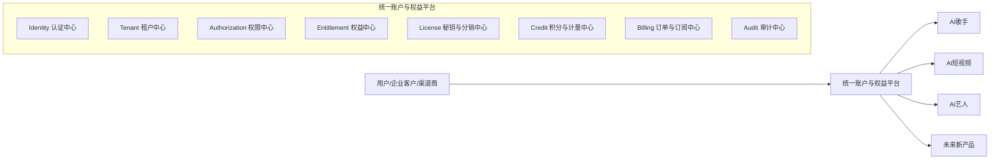
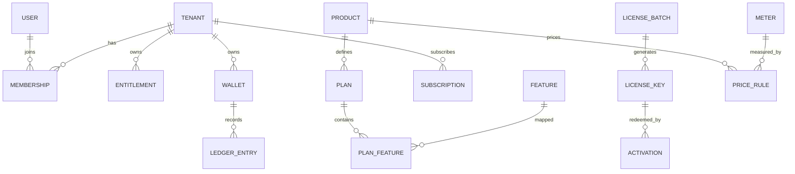
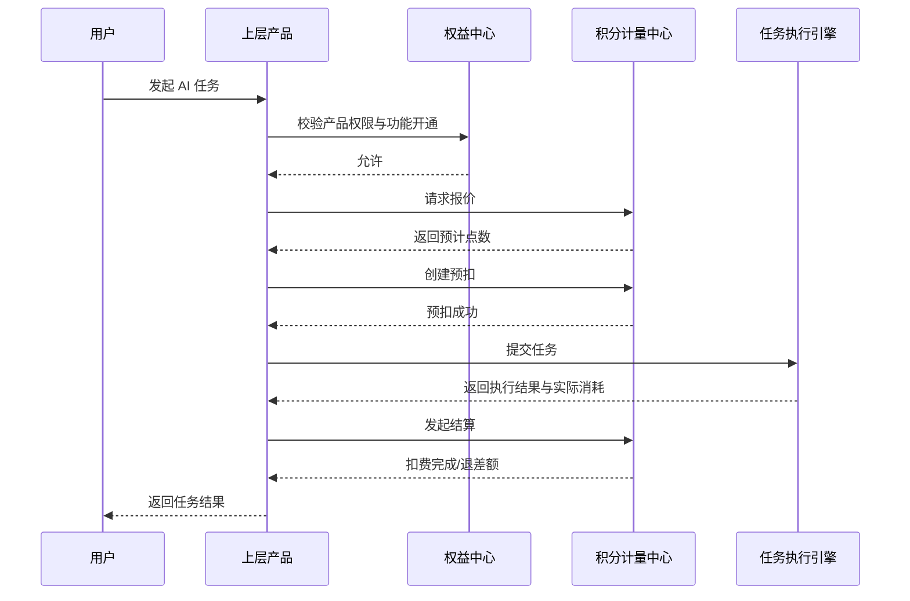
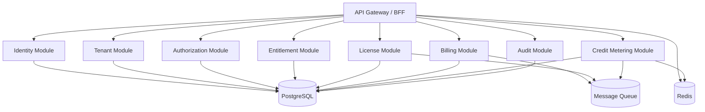

# 统一认证、权益、分销与积分计量平台技术方案

## 1. 文档目标

本文档用于设计一套可支撑多产品线的统一平台能力，覆盖以下核心目标：

- 支持多个上层产品统一接入，例如 `AI歌手`、`AI短视频`、`AI艺人`
- 提供统一认证中心，实现账号、组织、单点登录和会话管理
- 提供统一权限中心，支持平台角色、租户角色和产品权限控制
- 提供统一权益中心，支持套餐、功能、席位、额度、有效期管理
- 提供统一秘钥与分销体系，支持渠道发卡、兑换、升级、续费和返佣
- 提供统一积分与计量体系，支持 AI 能力按次扣费、预扣、结算、退回
- 保持平台能力可配置、可扩展、可审计，避免每个业务站点重复建设

## 2. 设计原则

### 2.1 核心原则

- `认证` 负责回答“你是谁”
- `权限` 负责回答“你能做什么操作”
- `权益` 负责回答“你买了什么、开通了什么”
- `积分/计量` 负责回答“你还能消耗多少”
- `秘钥` 负责承载权益兑换，不直接承担长期登录认证职责

### 2.2 边界原则

- 不把 `账号`、`角色`、`套餐`、`积分` 混在同一张表中
- 不把 `秘钥` 当作登录凭证
- 不把 `套餐权限` 写死在业务代码中
- 不把所有权限和权益都编码进 JWT
- 所有余额变更都必须走不可变流水
- 所有关键操作都必须可审计、可追踪、可回放

## 3. 总体架构

### 3.1 平台定位

建议将该能力独立建设为统一平台，作为所有业务产品的底层能力中心。

平台建议命名为：

- `Account & Entitlement Platform`
- 或 `统一账户与权益中心`

### 3.2 分层架构



### 3.3 上层产品与平台职责划分

#### 统一平台负责

- 用户注册、登录、账号安全
- 组织与成员体系
- 单点登录 SSO
- 角色与权限
- 套餐、功能、席位、额度
- 卡密、批次、渠道库存、激活、吊销
- 订单、订阅、升级、续费
- 积分账户、价格规则、扣费、退款、过期
- 审计日志、风控、限流

#### 业务产品负责

- 本产品的业务对象和业务流程
- 本产品的任务执行和业务状态
- 本产品的内容、素材、项目、记录
- 调用平台判断当前用户的权限和权益
- 调用平台完成积分预扣和结算

## 4. 业务场景

本方案需要同时覆盖以下场景：

- 用户注册后购买或兑换 `AI歌手` 套餐
- 用户登录后升级 `AI短视频` 高级版
- 企业客户在同一租户下同时开通 `AI歌手` 和 `AI艺人`
- 渠道商批量售卖兑换码
- 用户通过卡密兑换套餐或积分包
- 企业管理员给子账号分配角色和产品使用范围
- 用户使用点数调用图片、音乐、视频等 AI 能力
- 异步任务执行失败后退回积分
- 多产品共享统一账号体系和统一钱包

## 5. 统一领域模型

### 5.1 核心实体概览

| 模块 | 核心实体 | 说明 |
| --- | --- | --- |
| 认证 | `User` | 用户账号 |
| 租户 | `Tenant` | 企业、团队、工作区 |
| 成员 | `Membership` | 用户与租户关系 |
| 权限 | `Role` `Permission` | 角色与权限点 |
| 产品 | `Product` | 业务产品定义 |
| 套餐 | `Plan` | 产品套餐 |
| 功能 | `Feature` | 可开通的功能点 |
| 权益 | `Entitlement` | 已生效的功能、席位、额度 |
| 秘钥 | `LicenseBatch` `LicenseKey` `Activation` | 卡密和兑换记录 |
| 渠道 | `ChannelPartner` `ChannelInventory` | 分销库存和归属 |
| 订单 | `Order` `Subscription` | 购买、升级、续费 |
| 积分 | `Wallet` `LedgerEntry` `ConsumeOrder` | 积分账户和流水 |
| 计量 | `Meter` `PriceRule` | AI 调用计量和计价规则 |
| 审计 | `AuditLog` | 安全和运营审计 |

### 5.2 核心关系



## 6. 统一认证中心设计

### 6.1 认证能力

统一认证中心应支持：

- 手机号验证码登录
- 邮箱验证码登录
- 用户名密码登录
- 第三方 OAuth 登录
- 后续企业级 SSO 扩展
- 会话管理与 Token 刷新
- MFA 多因子认证扩展
- 设备登录记录

### 6.2 协议建议

推荐采用标准协议：

- `OAuth 2.0`
- `OpenID Connect`

推荐域名规划：

- `accounts.example.com`：统一登录中心
- `singer.example.com`：AI歌手
- `video.example.com`：AI短视频
- `artist.example.com`：AI艺人

### 6.3 Token 设计

`Access Token` 只放最小必要信息：

- `user_id`
- `tenant_id`
- `session_id`
- `token_version`
- `issued_at`
- `expired_at`

不建议在 Token 中放入：

- 全量权限列表
- 全量套餐能力
- 全量余额信息

这些信息应由产品侧按需查询统一平台，或使用短期缓存。

## 7. 租户与成员体系设计

### 7.1 租户模型

建议平台以 `Tenant` 为权益归属主体，适配企业和团队场景。

典型租户类型：

- 个人工作室
- 企业客户
- 渠道代理商
- 内部运营组织

### 7.2 成员角色模型

建议角色分三层设计：

#### 平台级角色

- `platform_owner`
- `platform_operator`
- `finance_admin`
- `channel_manager`

#### 租户级角色

- `tenant_owner`
- `tenant_admin`
- `tenant_operator`
- `tenant_member`
- `tenant_viewer`

#### 产品级权限

- `ai_singer.project.create`
- `ai_singer.voice.generate`
- `ai_video.render.submit`
- `ai_video.template.manage`
- `ai_artist.campaign.manage`

### 7.3 鉴权判断公式

每次访问产品功能时，统一判断以下条件：

```text
允许访问 = 已登录
       AND 属于目标租户
       AND 角色具备操作权限
       AND 当前租户已开通对应产品/功能
       AND 对应额度或积分充足
```

## 8. 产品、套餐与权益体系设计

### 8.1 产品模型

产品为一级维度，例如：

- `ai_singer`
- `ai_video`
- `ai_artist`

后续可继续扩展：

- `ai_image`
- `ai_voiceover`
- `ai_live`

### 8.2 套餐模型

每个产品可配置多个套餐：

- `basic`
- `pro`
- `business`
- `enterprise`

套餐不应直接等价于角色。套餐定义的是商业能力边界，而不是后台操作权限。

### 8.3 权益模型

`Entitlement` 用于表达已经生效的商业权益，建议支持以下维度：

- 已开通产品
- 已开通功能点
- 席位数上限
- 调用额度上限
- 存储额度
- API 调用额度
- AI 点数月配额
- 生效时间
- 到期时间
- 叠加规则

### 8.4 权益类型

建议至少支持以下权益类型：

- `feature_access`：功能开通
- `seat_limit`：席位数量
- `quota_limit`：固定额度
- `monthly_credit`：月度点数
- `addon`：增值包
- `bundle_access`：组合包产品权益

## 9. 秘钥与分销体系设计

### 9.1 秘钥定位

秘钥不用于长期登录认证，而用于以下场景：

- 套餐激活
- 时长兑换
- 席位扩容
- 点数兑换
- 附加包兑换
- 渠道卡密销售

### 9.2 秘钥实体设计

推荐拆为两层：

- `LicenseBatch`：批次定义
- `LicenseKey`：单个秘钥

#### LicenseBatch 核心字段

- `batch_no`
- `product_id`
- `plan_id`
- `license_type`
- `duration_days`
- `seat_delta`
- `credit_delta`
- `bind_type`
- `channel_partner_id`
- `valid_from`
- `valid_to`
- `max_activation_count`

#### LicenseKey 核心字段

- `code_hash`
- `batch_id`
- `status`
- `allocated_to`
- `sold_at`
- `activated_at`
- `activated_by_user_id`
- `activated_tenant_id`
- `revoked_at`

### 9.3 秘钥状态机

- `created`
- `allocated`
- `sold`
- `activated`
- `expired`
- `revoked`

### 9.4 分销体系设计

建议新增渠道域模型：

- `ChannelPartner`
- `ChannelInventory`
- `ChannelSettlement`
- `CommissionRule`

渠道业务支持：

- 生成渠道专属卡密
- 渠道领用库存
- 渠道折扣价和建议零售价
- 客户兑换后自动核销
- 根据激活记录进行分佣和售后归属

## 10. 积分与计量体系设计

### 10.1 设计目标

除套餐开通外，平台还需要支持 AI 能力的按次计费。  
推荐将其作为独立模块 `Credit & Metering Center` 建设。

### 10.2 核心概念

#### 钱包

`Wallet` 是余额承载主体，建议优先挂在 `Tenant` 维度，也可扩展用户子钱包。

#### 科目

`CreditAccount` 表示不同类型的点数账户，例如：

- 通用点数
- AI图片点数
- AI音乐点数
- AI视频点数
- 赠送点数
- 月度套餐点数

#### 流水

`LedgerEntry` 是不可变积分流水，所有增加、扣减、冻结、返还都必须记录。

#### 计量项

`Meter` 表示计费动作，例如：

- `image.generate`
- `music.generate`
- `video.render.minute`
- `voice.clone`
- `project.export`

#### 价格规则

`PriceRule` 表示不同条件下的计价规则，例如：

- 产品
- 动作
- 模型版本
- 套餐级别
- 分辨率
- 时长
- 渠道
- 活动

### 10.3 积分类型建议

建议至少支持以下点数类型：

- `recharge_credit`：充值点数
- `gift_credit`：赠送点数
- `plan_monthly_credit`：套餐月赠点数
- `addon_credit`：加油包点数
- `product_credit`：产品专属点数

### 10.4 消费优先级

建议默认优先消耗：

1. 快过期的赠送点数
2. 产品专属点数
3. 套餐月赠点数
4. 通用充值点数

### 10.5 AI 任务扣费模型

对于图片、音乐、视频等异步 AI 能力，建议使用三阶段扣费：

1. `预估价格`
2. `预扣冻结`
3. `完成结算`

如任务失败，则执行：

- `全额退回`
- 或 `按已消耗资源部分结算`

### 10.6 积分扣费流程



### 10.7 为什么不能只存余额

如果仅在用户表保存一个 `credit_balance` 字段，会导致以下问题：

- 无法支持预扣与结算
- 无法支持失败退回
- 无法支持多种点数科目
- 无法支持对账和审计
- 无法支持过期和冻结
- 无法复盘历史消耗

因此必须采用 `账户 + 流水账本` 模型。

## 11. 核心业务流程设计

### 11.1 用户注册并兑换秘钥

```text
注册账号 -> 创建或加入租户 -> 登录 -> 输入秘钥 -> 校验秘钥状态 ->
生成激活记录 -> 写入权益 -> 生效产品功能/席位/点数
```

### 11.2 用户在线升级套餐

```text
登录 -> 选择产品和套餐 -> 创建订单 -> 支付成功 ->
生成或更新订阅 -> 重算权益 -> 立即生效
```

### 11.3 企业管理员开通子账号

```text
租户管理员登录 -> 邀请成员 -> 成员加入租户 ->
分配角色 -> 检查席位是否足够 -> 完成开通
```

### 11.4 使用点数调用 AI 功能

```text
发起功能调用 -> 鉴权 -> 校验权益 -> 计价 -> 预扣 ->
异步执行 -> 完成结算 -> 写流水 -> 返回结果
```

### 11.5 渠道商售卖卡密

```text
平台生成批次 -> 分配库存给渠道 -> 渠道售卖 -> 客户兑换 ->
库存核销 -> 记录归属 -> 参与结算与返佣
```

## 12. API 设计建议

### 12.1 认证与账号 API

- `POST /api/auth/register`
- `POST /api/auth/login`
- `POST /api/auth/logout`
- `POST /api/auth/refresh`
- `GET /api/me`
- `GET /api/me/tenants`

### 12.2 租户与成员 API

- `POST /api/tenants`
- `GET /api/tenants/{tenantId}`
- `POST /api/tenants/{tenantId}/members/invite`
- `PATCH /api/tenants/{tenantId}/members/{memberId}/role`
- `GET /api/tenants/{tenantId}/members`

### 12.3 权益 API

- `GET /api/tenants/{tenantId}/entitlements`
- `GET /api/tenants/{tenantId}/features/check`
- `GET /api/tenants/{tenantId}/plans`
- `POST /api/tenants/{tenantId}/plans/upgrade`

### 12.4 秘钥与分销 API

- `POST /api/licenses/redeem`
- `GET /api/licenses/batches`
- `POST /api/licenses/batches`
- `GET /api/channels`
- `POST /api/channels/{channelId}/inventory/allocate`
- `GET /api/channels/{channelId}/settlements`

### 12.5 积分与计量 API

- `GET /api/tenants/{tenantId}/wallets`
- `GET /api/tenants/{tenantId}/ledger`
- `POST /api/metering/quote`
- `POST /api/metering/reserve`
- `POST /api/metering/settle`
- `POST /api/metering/release`
- `POST /api/credits/grant`

### 12.6 产品接入 API

供上层产品调用的平台接口建议包括：

- `POST /internal/access/check`
- `POST /internal/entitlements/resolve`
- `POST /internal/metering/quote`
- `POST /internal/metering/reserve`
- `POST /internal/metering/settle`
- `POST /internal/metering/release`

## 13. 数据库表设计建议

### 13.1 认证与租户域

- `users`
- `user_credentials`
- `user_oauth_accounts`
- `sessions`
- `tenants`
- `memberships`
- `invites`

### 13.2 权限域

- `roles`
- `permissions`
- `role_permissions`
- `membership_roles`

### 13.3 产品与权益域

- `products`
- `plans`
- `features`
- `plan_features`
- `entitlements`
- `entitlement_items`
- `subscriptions`

### 13.4 秘钥与分销域

- `license_batches`
- `license_keys`
- `license_activations`
- `channel_partners`
- `channel_inventory`
- `channel_settlements`
- `commission_rules`

### 13.5 积分与计量域

- `wallets`
- `credit_accounts`
- `ledger_entries`
- `meters`
- `price_rules`
- `consume_orders`
- `credit_expirations`

### 13.6 审计与风控域

- `audit_logs`
- `operation_logs`
- `risk_events`
- `idempotency_records`

## 14. 权限、权益、积分的协同关系

三者关系建议如下：

- `角色权限` 决定用户能否发起某个动作
- `产品权益` 决定该租户是否已开通该产品或功能
- `积分计量` 决定该动作能否继续执行以及本次应扣多少

例如：

- 用户是 `tenant_admin`
- 租户开通了 `AI短视频 Pro`
- 当前钱包仍有 800 点
- 该用户才能发起一次 4K 渲染任务

如果任一条件不满足，则应明确返回失败原因：

- 未登录
- 无租户访问权限
- 套餐未开通
- 功能未授权
- 席位不足
- 积分不足

## 15. 安全设计

### 15.1 认证安全

- Access Token 短期有效
- Refresh Token 支持轮换
- 敏感操作支持二次验证
- 支持设备与会话管理

### 15.2 秘钥安全

- 秘钥只存 `hash`
- 兑换接口限流和风控
- 秘钥支持吊销和冻结
- 批次和单码都要有状态机

### 15.3 积分安全

- 扣费接口必须幂等
- 异步任务必须可回查订单号
- 禁止直接改余额
- 所有补点、退款都走流水冲正

### 15.4 数据安全

- 操作日志全量记录
- 后台改权行为审计
- 关键接口具备签名或内部鉴权
- 支持 IP、设备、用户维度风控

## 16. 技术实现建议

### 16.1 服务拆分建议

在早期阶段，不建议一开始就拆成很多微服务。  
建议先采用 `模块化单体 + 清晰边界` 的方式建设。

推荐模块：

- `identity-module`
- `tenant-module`
- `authz-module`
- `entitlement-module`
- `license-module`
- `billing-module`
- `credit-metering-module`
- `audit-module`

### 16.2 技术栈建议

结合当前后端方向，推荐使用：

- `Spring Boot`
- `Spring Security`
- `Spring Data JPA`
- `PostgreSQL`
- `Redis`
- `Kafka` 或 `RabbitMQ`
- `Quartz` 或定时任务调度

说明：

- 生产环境不建议继续使用 H2 作为主数据库
- 鉴权、余额、幂等、限流场景应使用 Redis
- 订单、任务、积分结算建议事件化解耦

### 16.3 模块职责示意



## 17. 关键规则建议

### 17.1 套餐升级规则

- 升级立即生效
- 剩余时长按规则折算
- 功能按高等级覆盖
- 席位和额度按目标套餐重算或叠加

### 17.2 续费规则

- 订阅未过期时，续费追加到期时间
- 已过期时，重新计算生效周期

### 17.3 点数规则

- 赠送点可设置到期时间
- 月赠点按月重置，不长期累计
- 加油包点数可独立有效期
- 过期点数通过系统任务自动失效并记流水

### 17.4 渠道规则

- 不同渠道可绑定不同价格体系
- 渠道库存必须可盘点
- 激活归属决定售后和分佣归属

## 18. 非功能性要求

平台应满足以下非功能性要求：

- 高可用：认证和扣费接口需高可用部署
- 可扩展：新增产品和套餐无需大改代码
- 可审计：关键业务动作均可追踪
- 可配置：套餐、功能、价格、渠道策略尽量后台配置化
- 可回滚：关键扣费和改权操作支持补偿
- 可观测：具备日志、指标、链路追踪

## 19. 分阶段落地路线

### 19.1 第一阶段：MVP

目标：快速支撑一个到两个产品接入。

包含：

- 用户注册登录
- 租户与成员体系
- 基础角色权限
- 产品、套餐、功能点
- 秘钥兑换
- 订阅升级与续费
- 租户钱包
- 基础积分流水
- AI 调用预扣和结算
- 审计日志

### 19.2 第二阶段：渠道与企业版

包含：

- 渠道库存
- 批次发卡
- 分销结算
- 企业套餐
- 席位扩容
- 产品组合包
- API 接入鉴权

### 19.3 第三阶段：平台化与开放能力

包含：

- 标准 OIDC SSO
- 开放平台 SDK
- Webhook 事件中心
- 计价规则后台化
- 更精细的风控和结算体系

## 20. 结论

建议将该能力建设为一套独立的统一平台，而不是分散实现于每个业务产品中。

平台的本质不是单一认证中心，而是：

- `统一认证中心`
- `统一租户中心`
- `统一权限中心`
- `统一权益中心`
- `统一秘钥与分销中心`
- `统一积分与计量中心`

最终设计原则可归纳为一句话：

> 账号体系负责认证，RBAC 负责授权，Entitlement 负责商业开通，Credit 负责按次计量，License 负责兑换和分销。

在该模型下，`AI歌手`、`AI短视频`、`AI艺人` 等不同产品都可以复用统一底座，并保持后续扩展新产品、新套餐、新积分规则时的稳定性和可维护性。
