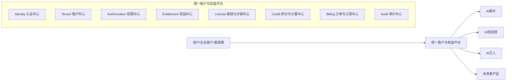
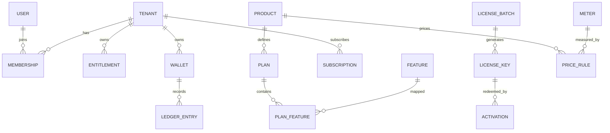
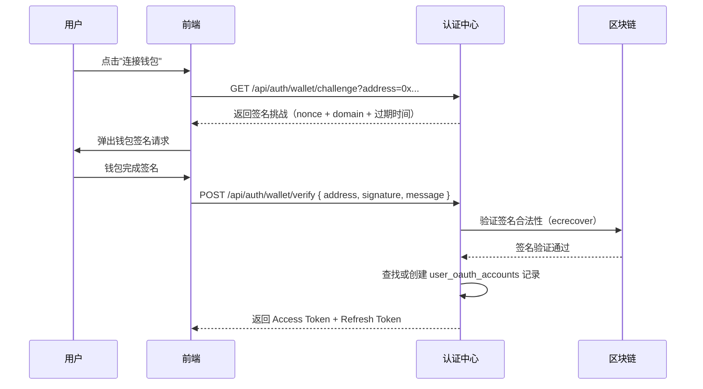
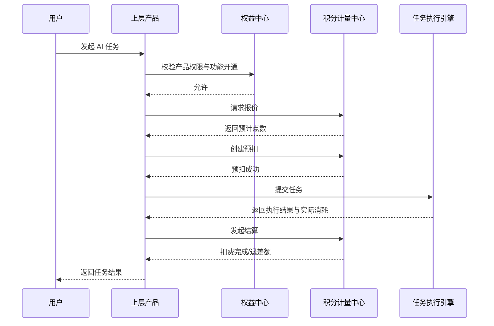
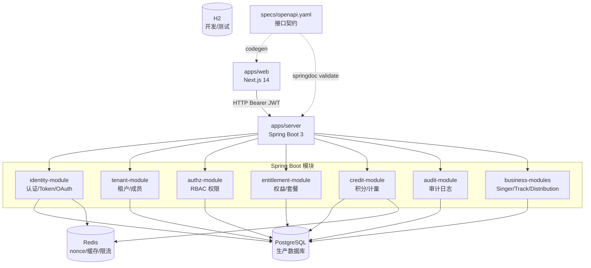
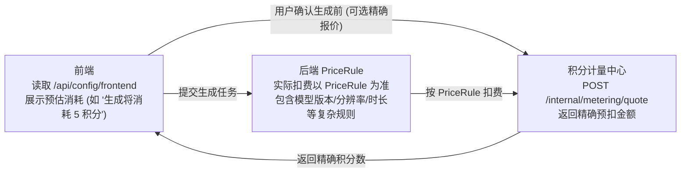

# 统一认证、权益、分销与积分计量平台技术方案

**文档版本**: v1.2.0  
**最后更新**: 2026-04-15  
**当前状态**: AI Star Eco Phase 1 实施中 — 管理后台认证与权益管理已落地  

## 文档版本迭代记录

| 版本 | 日期 | 变更说明 |
|------|------|----------|
| v1.2.0 | 2026-04-15 | 实施管理后台认证体系（JWT 登录 + 角色鉴权）、秘钥激活注册流程、权益配置 CRUD 功能、管理员与普通用户角色分离。更新实现状态附录。 |
| v1.1.0 | 2026-04-14 | 根据 2026-04-14 需求对齐会议，补充激活码授权、预付/激活结算模式、独立运行并预留对接”艺人公司”系统、统一积分消费、编辑能力分层与外部收益回流规则。 |
| v1.0.0 | 历史基线 | 仓库原有统一认证、权益、分销与积分计量平台方案。 |

## 1. 文档目标

本文档用于设计一套可支撑多产品线的统一平台能力，覆盖以下核心目标：

- 支持多个上层产品统一接入，例如 `AI歌手`、`AI短视频`、`AI艺人`
- 提供统一认证中心，实现账号、组织、单点登录和会话管理
- 提供统一权限中心，支持平台角色、租户角色和产品权限控制
- 提供统一权益中心，支持套餐、功能、席位、额度、有效期管理
- 提供统一秘钥与分销体系，支持渠道发卡、兑换、升级、续费和返佣
- 提供统一积分与计量体系，支持 AI 能力按次扣费、预扣、结算、退回
- 保持平台能力可配置、可扩展、可审计，避免每个业务站点重复建设

结合 2026-04-14 的项目需求会，本文档额外约束 **AI Star Eco 当前阶段** 的落地策略：

- 第一阶段以 **音乐生成与分发** 为主，不把 MV 与专业音视频编辑作为上线阻塞项
- 平台需要 **独立运行**，同时必须预留与“艺人公司”系统做批次、激活码、结算同步的能力
- 对外分销层面避免在工具前台暴露明显的层级分销逻辑，优先采用 **激活码授权** 抽象
- 平台内的购买、解锁、算力调用优先收敛到 **统一积分体系**

## 2. 设计原则

### 2.1 核心原则

- `认证` 负责回答"你是谁"
- `权限` 负责回答"你能做什么操作"
- `权益` 负责回答"你买了什么、开通了什么"
- `积分/计量` 负责回答"你还能消耗多少"
- `秘钥` 负责承载权益兑换，不直接承担长期登录认证职责

### 2.2 边界原则

- 不把 `账号`、`角色`、`套餐`、`积分` 混在同一张表中
- 不把 `秘钥` 当作登录凭证
- 不把 `套餐权限` 写死在业务代码中
- 不把所有权限和权益都编码进 JWT
- 所有余额变更都必须走不可变流水
- 所有关键操作都必须可审计、可追踪、可回放

## 3. 总体架构

### 3.1 平台定位

建议将该能力独立建设为统一平台，作为所有业务产品的底层能力中心。

平台建议命名为：

- `Account & Entitlement Platform`
- 或 `统一账户与权益中心`

### 3.2 分层架构



### 3.3 上层产品与平台职责划分

#### 统一平台负责

- 用户注册、登录、账号安全
- 组织与成员体系
- 单点登录 SSO
- 角色与权限
- 套餐、功能、席位、额度
- 卡密、批次、渠道库存、激活、吊销
- 订单、订阅、升级、续费
- 积分账户、价格规则、扣费、退款、过期
- 外部系统批次/激活记录同步与对账
- 审计日志、风控、限流

#### 业务产品负责

- 本产品的业务对象和业务流程
- 本产品的任务执行和业务状态
- 本产品的内容、素材、项目、记录
- 调用平台判断当前用户的权限和权益
- 调用平台完成积分预扣和结算
- 决定收益数据是“平台内分账”还是“回流外部平台账号”

## 4. 业务场景

本方案需要同时覆盖以下场景：

- 用户注册后购买或兑换 `AI歌手` 套餐
- 用户登录后升级 `AI短视频` 高级版
- 企业客户在同一租户下同时开通 `AI歌手` 和 `AI艺人`
- 渠道商批量售卖兑换码
- 用户通过卡密兑换套餐或积分包
- 企业管理员给子账号分配角色和产品使用范围
- 用户使用点数调用图片、音乐、视频等 AI 能力
- 异步任务执行失败后退回积分
- 多产品共享统一账号体系和统一钱包
- 渠道商批量售卖账号授权码，但工具前台不展示多级分销层级
- AI Star Eco 先独立售卖账号与积分，后续再与“艺人公司”系统打通库存与结算
- 一个账号激活后默认获得固定艺人名额和初始积分，例如 3 个 AI 艺人名额 + 100 积分

## 5. 统一领域模型

### 5.1 核心实体概览

| 模块 | 核心实体                                     | 说明           |
| -- | ---------------------------------------- | ------------ |
| 认证 | `User`                                   | 用户账号         |
| 租户 | `Tenant`                                 | 企业、团队、工作区    |
| 成员 | `Membership`                             | 用户与租户关系      |
| 权限 | `Role` `Permission`                      | 角色与权限点       |
| 产品 | `Product`                                | 业务产品定义       |
| 套餐 | `Plan`                                   | 产品套餐         |
| 功能 | `Feature`                                | 可开通的功能点      |
| 权益 | `Entitlement`                            | 已生效的功能、席位、额度 |
| 秘钥 | `LicenseBatch` `LicenseKey` `Activation` | 卡密和兑换记录      |
| 渠道 | `ChannelPartner` `ChannelInventory`      | 分销库存和归属      |
| 订单 | `Order` `Subscription`                   | 购买、升级、续费     |
| 积分 | `Wallet` `LedgerEntry` `ConsumeOrder`    | 积分账户和流水      |
| 计量 | `Meter` `PriceRule`                      | AI 调用计量和计价规则 |
| 审计 | `AuditLog`                               | 安全和运营审计      |

### 5.2 核心关系



## 6. 统一认证中心设计

### 6.1 认证能力

统一认证中心应支持以下认证方式：

#### 基础认证

- 手机号验证码登录
- 邮箱验证码登录
- 用户名密码登录

#### 第三方 OAuth 登录（AI Star Eco 产品必须支持）

| 登录方式               | 适用用户群体                | 优先级 |
| ------------------ | --------------------- | --- |
| Google OAuth 2.0   | 全球用户，制作人/粉丝主要登录方式     | P0  |
| 微信 OAuth           | 中国大陆用户核心渠道，粉丝/制作人     | P0  |
| MetaMask 钱包签名      | Web3 用户，NFT 铸造和链上资产场景 | P1  |
| WalletConnect      | Web3 用户补充，移动端钱包       | P1  |
| Coinbase Wallet    | 海外 Web3 用户            | P2  |
| 企业级 SSO（SAML/OIDC） | MCN 机构、企业客户           | P2  |

#### 扩展能力

- 会话管理与 Token 刷新
- MFA 多因子认证扩展（TOTP/短信/邮件）
- 设备登录记录与异地登录告警
- 账号注销与数据清理

### 6.2 AI Star Eco 特有认证场景

#### 6.2.1 Web3 钱包身份认证

AI Star Eco 集成了 NFT 铸造与链上资产体系，Web3 钱包登录是平台差异化能力。

**钱包登录流程（EIP-4361 Sign-In with Ethereum）：**



**钱包账号与平台账号绑定规则：**

- 首次钱包登录：自动创建平台账号，`wallet_address` 作为主要标识
- 已有账号绑定钱包：在 `user_oauth_accounts` 表中新增 `provider=web3_wallet` 记录
- 同一钱包地址只能绑定一个平台账号，防止重复注册
- 钱包登录的用户可后续绑定邮箱/手机号，完善账号信息

**安全要求：**

- 签名挑战（nonce）单次有效，5 分钟过期
- 挑战信息中包含 `domain` 防止跨站重放
- 服务端验证 `ecrecover` 得出的地址与请求地址一致

#### 6.2.2 微信 OAuth 登录（国内市场）

微信 OAuth 是中国大陆用户最主要的登录方式：

- 微信网页授权（扫码登录）：适用于 PC 端制作人后台
- 微信公众号网页授权：适用于移动端 H5 场景
- `openid` 作为微信用户唯一标识，`unionid` 用于跨公众号/小程序的账号统一

**微信账号与平台账号绑定规则：**

- `openid` 和 `unionid` 均存入 `user_oauth_accounts`
- 同一微信 `unionid` 只能绑定一个平台账号

#### 6.2.3 掌门人（MCN Coach）的多角色认证

掌门人是 AI Star Eco 的特殊角色，拥有管理学员制作人的权限。其认证特殊性：

- 掌门人使用相同登录入口，通过 `role=coach` 区分
- 掌门人登录后，`session` 需携带其管理的 `coach_squad_id` 信息
- 掌门人对学员的审批操作（approve/reject）需要记录完整审计链路
- 建议为掌门人开启登录二次验证（可选 TOTP）

#### 6.2.4 第三方平台账号绑定（非登录认证）

AI Star Eco 的发行模块需要绑定外部音乐平台账号（DistroKid、腾讯音乐人、网易云音乐人等），这与**登录认证**是两个完全不同的概念：

| 维度       | 登录认证 OAuth   | 平台账号绑定 OAuth                |
| -------- | ------------ | --------------------------- |
| 目的       | 验证"你是谁"      | 授权平台代表用户操作第三方服务             |
| Token 归属 | 认证中心管理       | 业务层（Distribution Module）管理  |
| Token 存储 | `sessions` 表 | `platform_accounts` 表（加密存储） |
| 失效处理     | 用户需重新登录      | 静默刷新，失败时提示重新授权              |
| 安全级别     | 核心安全链路       | 业务功能链路                      |

**结论**：DistroKid、腾讯音乐人等平台的 OAuth Token 由业务层的 `Distribution Module` 独立管理，不经过统一认证中心，但使用认证中心的 `user_id` 作为关联键。

### 6.3 协议建议

推荐采用标准协议：

- `OAuth 2.0`
- `OpenID Connect`

推荐域名规划：

- `accounts.example.com`：统一登录中心
- `singer.example.com`：AI歌手（AI Star Eco）
- `video.example.com`：AI短视频
- `artist.example.com`：AI艺人

### 6.4 Token 设计

`Access Token` 只放最小必要信息：

```json
{
  "user_id": "uuid",
  "tenant_id": "uuid",
  "session_id": "uuid",
  "role": "producer",
  "token_version": 1,
  "issued_at": 1712345678,
  "expired_at": 1712349278
}
```

**说明：**

- `role` 字段（`fan` / `producer` / `coach`）允许放入 Token，因为这是粗粒度、低频变更的信息，可避免每次请求都查库判断入口路由
- `plan`（套餐类型）、`credits`（积分余额）、细粒度权限列表不放入 Token，由产品侧按需查询或使用短期 Redis 缓存

不建议在 Token 中放入：

- 全量权限列表
- 套餐功能清单
- 当前积分余额

这些信息应由产品侧按需查询统一平台，或使用短期缓存（TTL 建议 60 秒）。

### 6.5 会话与设备管理

```typescript
interface Session {
  id: string;
  user_id: string;
  tenant_id: string;
  device_fingerprint: string;
  device_type: 'web' | 'mobile' | 'api';
  ip_address: string;
  user_agent: string;
  login_method: 'email' | 'phone' | 'google' | 'wechat' | 'metamask' | 'walletconnect';
  is_active: boolean;
  last_active_at: string;
  expires_at: string;
  created_at: string;
}
```

支持能力：

- 查看所有活跃设备登录列表
- 主动吊销指定设备的会话
- 异地登录检测（IP 地域突变 → 触发二次验证）
- 全局登出（吊销所有 Refresh Token）

### 6.6 用户账号数据模型

针对 AI Star Eco 产品补充的完整 User 模型：

```typescript
interface User {
  id: string;                          // UUID 主键
  username: string;                    // 用户名，3–50字符，唯一
  email: string | null;                // 邮箱（可选，OAuth 登录可无邮箱）
  phone: string | null;                // 手机号（可选）
  avatar_url: string | null;           // 头像 URL
  display_name: string | null;         // 展示名（昵称）
  wallet_address: string | null;       // 主绑定 Web3 钱包地址（ETH 格式）
  role: 'fan' | 'producer' | 'coach';  // 平台角色（决定入口视图）
  plan: 'free' | 'pro' | 'enterprise'; // 当前套餐（冗余字段，权威数据在 Entitlement）
  credits: number;                     // 当前 AI 积分（冗余字段，权威数据在 Wallet）
  lang_preference: 'zh' | 'en';        // 语言偏好，默认 zh
  theme_preference: string;            // 主题偏好，默认 cyberpunk
  status: 'active' | 'suspended' | 'deleted';
  email_verified: boolean;
  phone_verified: boolean;
  created_at: string;
  updated_at: string;
  last_login_at: string | null;
}
```

**注意：`plan`** **和** **`credits`** **作为冗余字段存在用户表，方便 JWT 无感知快速判断，但所有变更必须以 Entitlement / Wallet 为准，用户表字段通过异步任务同步。**

### 6.7 OAuth 第三方账号表

```typescript
interface UserOAuthAccount {
  id: string;
  user_id: string;                     // 关联 User.id
  provider: 'google' | 'wechat' | 'metamask' | 'walletconnect' | 'coinbase' | 'saml';
  provider_user_id: string;            // 第三方平台的用户唯一标识
  provider_username: string | null;    // 第三方平台用户名（展示用）
  provider_email: string | null;       // 第三方平台邮箱
  provider_avatar: string | null;      // 第三方平台头像
  access_token_encrypted: string | null;  // 加密存储的 Access Token
  refresh_token_encrypted: string | null; // 加密存储的 Refresh Token
  token_expires_at: string | null;
  extra_data: Record<string, unknown> | null; // 存储微信 unionid、钱包链名等额外信息
  is_primary: boolean;                 // 是否为主要登录方式
  created_at: string;
  updated_at: string;
}
```

## 7. 租户与成员体系设计

### 7.1 租户模型

建议平台以 `Tenant` 为权益归属主体，适配企业和团队场景。

典型租户类型：

- 个人工作室
- 企业客户
- 渠道代理商
- 内部运营组织

**AI Star Eco 补充说明**：在 AI Star Eco 产品中，个人制作人默认归属于自己的个人租户（系统注册时自动创建）；MCN 掌门人管理的工作室是一个组织租户，制作人学员通过邀请加入该租户。

### 7.2 成员角色模型

建议角色分三层设计：

#### 平台级角色

- `platform_owner`
- `platform_operator`
- `finance_admin`
- `channel_manager`

#### 租户级角色

- `tenant_owner`
- `tenant_admin`
- `tenant_operator`
- `tenant_member`
- `tenant_viewer`

#### 产品级权限（AI Star Eco 扩展）

针对 AI Star Eco 三角色体系，产品级权限点建议如下：

```
ai_singer.singer.create          创建 AI 歌手
ai_singer.singer.edit            编辑 AI 歌手参数/服装/姿态
ai_singer.singer.delete          删除/归档歌手
ai_singer.singer.publish         上架歌手到市场
ai_singer.music.generate         触发 AI 音乐生成（消耗积分）
ai_singer.music.distribute       发行音乐到外部平台
ai_singer.nft.mint               铸造 NFT 合集
ai_singer.marketplace.list       发布艺人到市场挂牌
ai_singer.marketplace.sign       签约市场艺人
ai_singer.chart.vote             为榜单投票
ai_singer.coach.manage_trainees  管理学员（掌门人专属）
ai_singer.coach.review_work      审核学员作品（掌门人专属）
ai_singer.coach.assign_task      下发任务给学员（掌门人专属）
```

**角色与权限映射：**

| 权限点                     |   fan   | producer（free） | producer（pro） | producer（enterprise） | coach |
| ----------------------- | :-----: | :------------: | :-----------: | :------------------: | :---: |
| `singer.create`         |    ❌    |     ✅（上限3）     |    ✅（上限20）    |         ✅（无限）        |   ❌   |
| `music.generate`        |    ❌    |     ✅（5点/天）    |    ✅（50点/天）   |         ✅（无限）        |   ❌   |
| `nft.mint`              |    ❌    |        ❌       |    ✅（10次/月）   |         ✅（无限）        |   ❌   |
| `marketplace.sign`      |    ❌    |        ❌       |       ❌       |           ✅          |   ❌   |
| `chart.vote`            | ✅（3票/天） |     ✅（3票/天）    |    ✅（3票/天）    |        ✅（3票/天）       |   ❌   |
| `coach.manage_trainees` |    ❌    |        ❌       |       ❌       |           ❌          |   ✅   |
| `coach.review_work`     |    ❌    |        ❌       |       ❌       |           ❌          |   ✅   |

### 7.3 鉴权判断公式

每次访问产品功能时，统一判断以下条件：

```text
允许访问 = 已登录
       AND 属于目标租户
       AND 角色具备操作权限
       AND 当前租户已开通对应产品/功能
       AND 对应额度或积分充足
```

## 8. 产品、套餐与权益体系设计

### 8.1 产品模型

产品为一级维度，例如：

- `ai_singer`
- `ai_video`
- `ai_artist`

后续可继续扩展：

- `ai_image`
- `ai_voiceover`
- `ai_live`

### 8.2 套餐模型

每个产品可配置多个套餐：

- `basic`
- `pro`
- `business`
- `enterprise`

套餐不应直接等价于角色。套餐定义的是商业能力边界，而不是后台操作权限。

**AI Star Eco 套餐限额对照：**

> **重要**：下表所有数值均为默认出厂值，实际运行时以可配置化功能参数中心（第 20 节）中的 `quota.*` 配置为准，运营人员可在后台实时修改，无需发版。

| 功能       | free   | pro     | enterprise  | 对应配置 Key                                        |
| -------- | ------ | ------- | ----------- | ----------------------------------------------- |
| AI 歌手数量  | 最多 3 个 | 最多 20 个 | 无限制         | `quota.singer_slot.{plan}`                      |
| 音乐生成次数/天 | 5 次/天  | 50 次/天  | 无限制         | `quota.music_generate.daily.{plan}`             |
| 轻编辑能力    | 可用     | 可用      | 可用          | `feature.editor.lite.enabled`                   |
| 高级编辑能力   | 不可用    | 可购买/按套餐开通 | 已包含       | `feature.editor.pro.enabled`                    |
| MV/视频生成  | Phase 2 | Phase 2 | 优先接入        | `feature.video.generate.enabled`                |
| NFT 铸造   | 不可用    | ≤10 次/月 | 无限制         | `quota.nft_mint.monthly.{plan}`                 |
| 发行渠道     | 仅国内    | 全部渠道    | 全部渠道 + 优先通道 | `quota.distribution_channel.{plan}`             |
| 每月可发行曲目  | 3 首/月  | 30 首/月  | 无限制         | `quota.track_publish.monthly.{plan}`            |
| 市场签约     | 不可用    | 不可用     | 可用          | 通过 `feature.marketplace.enabled` + Plan Feature |
| MCN 管理   | 不可用    | 不可用     | 可用          | 通过 `feature.mcn_coach.enabled` + Plan Feature   |
| 基因混合实验室  | 不可用    | 可用      | 可用          | `feature.gene_lab.enabled`                      |
| 传说级服装/姿态 | 不可用    | 可购买     | 已包含         | `credits.wardrobe.unlock.legendary`             |
| 粉丝社群模块   | 不可用    | 可用      | 可用          | `feature.fan_community.enabled`                 |

### 8.3 权益模型

`Entitlement` 用于表达已经生效的商业权益，建议支持以下维度：

- 已开通产品
- 已开通功能点
- 席位数上限
- 调用额度上限
- 存储额度
- API 调用额度
- AI 点数月配额
- 生效时间
- 到期时间
- 叠加规则

### 8.4 权益类型

建议至少支持以下权益类型：

- `feature_access`：功能开通（如基因实验室、MCN 管理）
- `seat_limit`：席位数量
- `quota_limit`：固定额度（如歌手数量上限）
- `monthly_credit`：月度积分配额（每日重置 or 每月重置）
- `addon`：增值包（如积分加油包、传说服装包）
- `bundle_access`：组合包产品权益

**AI Star Eco 补充权益类型：**

- `singer_slot`：可创建的 AI 歌手名额（free=3，pro=20，enterprise=unlimited）
- `nft_mint_quota`：NFT 铸造次数配额（monthly）
- `distribution_tier`：发行渠道等级（domestic / all / priority）
- `model_tier`：AI 生成模型质量等级（standard / advanced / flagship）
- `editor_tier`：编辑能力等级（lite / assisted / pro）
- `starter_credit`：激活即发放的初始积分包
- `activation_grant`：由激活码带来的账号授权、席位或额度
- `template_pack`：创始人IP、品牌IP等模板包开通权限

## 9. 秘钥与分销体系设计

### 9.1 秘钥定位

秘钥不用于长期登录认证，而用于以下场景：

- 套餐激活
- 时长兑换
- 席位扩容
- 点数兑换
- 附加包兑换
- 渠道卡密销售

**AI Star Eco 当前约束：**

- 秘钥首先承担“账号授权码/激活码”的职责，而不是前台展示分销层级
- 一个激活码可以同时带来：账号授权、艺人名额、初始积分、编辑能力等级
- 当外部“艺人公司”系统接入后，秘钥需要支持双边入库与对账，而不是单边裸发

### 9.2 秘钥实体设计

推荐拆为两层：

- `LicenseBatch`：批次定义
- `LicenseKey`：单个秘钥

#### LicenseBatch 核心字段

- `batch_no`
- `product_id`
- `plan_id`
- `license_type`
- `duration_days`
- `seat_delta`
- `credit_delta`
- `settlement_mode`
- `default_singer_slot_quota`
- `default_editor_tier`
- `bind_type`
- `channel_partner_id`
- `external_batch_no`
- `valid_from`
- `valid_to`
- `max_activation_count`

#### LicenseKey 核心字段

- `code_hash`
- `batch_id`
- `status`
- `allocated_to`
- `imported_at`
- `matched_at`
- `sold_at`
- `activated_at`
- `activated_by_user_id`
- `activated_tenant_id`
- `external_key_no`
- `revoked_at`

### 9.3 秘钥状态机

- `created`
- `imported`
- `allocated`
- `sold`
- `activated`
- `expired`
- `revoked`

### 9.4 分销体系设计

建议新增渠道域模型：

- `ChannelPartner`
- `ChannelInventory`
- `ChannelSettlement`
- `CommissionRule`
- `ExternalBatchSync`
- `ActivationSettlement`

渠道业务支持：

- 生成渠道专属卡密
- 渠道领用库存
- 渠道折扣价和建议零售价
- 客户兑换后自动核销
- 根据激活记录进行分佣和售后归属
- 支持 **预付结算** 与 **激活后结算** 两种模式
- 支持 **平台生成码** 与 **外部系统导入码** 两种来源
- 支持与“艺人公司”系统做批次号、码库存、激活记录双边匹配
- 前台不展示明显多级分销树，只暴露激活码、库存、授权与结算结果
- 支持白标/贴牌场景，不同区域或品牌可绑定不同批次策略与价格策略

## 10. 积分与计量体系设计

### 10.1 设计目标

除套餐开通外，平台还需要支持 AI 能力的按次计费。\
推荐将其作为独立模块 `Credit & Metering Center` 建设。

### 10.2 核心概念

#### 钱包

`Wallet` 是余额承载主体，建议优先挂在 `Tenant` 维度，也可扩展用户子钱包。

**AI Star Eco 当前建议：**

- Phase 1 前台只展示一个“统一积分余额”，降低理解成本
- 账务层仍允许拆分 `gift/recharge/plan/addon` 等子科目，保证审计与过期控制
- 激活码发放的初始积分优先落到 `gift_credit` 或 `activation_credit` 科目

#### 科目

`CreditAccount` 表示不同类型的点数账户，例如：

- 通用点数（前台统一显示为“积分”）
- AI图片点数
- AI音乐点数
- AI视频点数
- 赠送点数
- 月度套餐点数

#### 流水

`LedgerEntry` 是不可变积分流水，所有增加、扣减、冻结、返还都必须记录。

#### 计量项

`Meter` 表示计费动作，例如：

- `image.generate`
- `music.generate`
- `video.render.minute`
- `voice.clone`
- `project.export`

#### 价格规则

`PriceRule` 表示不同条件下的计价规则，例如：

- 产品
- 动作
- 模型版本
- 套餐级别
- 分辨率
- 时长
- 渠道
- 活动

### 10.3 积分类型建议

建议至少支持以下点数类型：

- `recharge_credit`：充值点数
- `gift_credit`：赠送点数
- `activation_credit`：激活码发放点数
- `plan_monthly_credit`：套餐月赠点数
- `addon_credit`：加油包点数
- `product_credit`：产品专属点数

### 10.4 消费优先级

建议默认优先消耗：

1. 快过期的赠送点数
2. 激活码发放点数
3. 产品专属点数
4. 套餐月赠点数
5. 通用充值点数

### 10.5 AI 任务扣费模型

对于图片、音乐、视频等异步 AI 能力，建议使用三阶段扣费：

1. `预估价格`
2. `预扣冻结`
3. `完成结算`

如任务失败，则执行：

- `全额退回`
- 或 `按已消耗资源部分结算`

**AI Star Eco 具体扣费规则：**

> **重要**：下表积分数值均为默认出厂值，实际以可配置化功能参数中心（第 20 节）`credits.*` 配置为准，后台可实时调整，前端通过 `GET /api/config/frontend` 读取最新值用于展示，后端通过 `PriceRule` 表决定实际扣费。

| 操作           | 消耗积分（默认值）    | 对应配置 Key                            | 扣费时机        | 失败退回      |
| ------------ | ------------ | ----------------------------------- | ----------- | --------- |
| 激活账号赠送积分      | +100 积分       | `credits.activation.default`        | 激活成功时发放    | 不适用        |
| 音乐生成（标准模式）   | 5 积分/次       | `credits.music.generate`            | 点击"生成"时预扣   | 生成失败全额退回  |
| 音乐生成（高级模型）   | 15 积分/次      | `credits.music.generate.advanced`   | 点击"生成"时预扣   | 失败全额退回    |
| 模板包解锁         | 20 积分/包      | `credits.template_pack.unlock`      | 点击"解锁"时立即扣费 | 不退回        |
| AI 歌手头像生成    | 3 积分/次       | `credits.singer.avatar.generate`    | 点击"生成"时预扣   | 失败全额退回    |
| 基因混合生成       | 10 积分/次      | `credits.singer.gene_mix`           | 点击"混合"时预扣   | 失败全额退回    |
| MV/视频生成      | 20 积分/分钟     | `credits.video.generate.per_minute` | 按实际时长结算     | 失败全额退回    |
| 传说服装解锁       | 100 积分/件     | `credits.wardrobe.unlock.legendary` | 点击"解锁"时立即扣费 | 不退回       |
| 传说姿态解锁       | 80 积分/个      | `credits.pose.unlock.legendary`     | 点击"解锁"时立即扣费 | 不退回       |
| NFT 铸造 Gas 费 | 链上 ETH，平台不干预 | —                                   | 链上交易时       | 链上失败退 ETH |

> 说明：`MV/视频生成` 与 `高级编辑` 在一期不是上线阻塞项，但平台层需要预先具备对应计量与开关能力，避免后续重构计费模型。

### 10.6 积分扣费流程



### 10.7 为什么不能只存余额

如果仅在用户表保存一个 `credit_balance` 字段，会导致以下问题：

- 无法支持预扣与结算
- 无法支持失败退回
- 无法支持多种点数科目
- 无法支持对账和审计
- 无法支持过期和冻结
- 无法复盘历史消耗

因此必须采用 `账户 + 流水账本` 模型。

## 11. 核心业务流程设计

### 11.1 用户注册并兑换秘钥

```text
注册账号 -> 创建或加入租户/工作区 -> 登录 -> 输入激活码 ->
校验批次状态/是否已入库匹配 -> 生成激活记录 ->
发放账号授权、艺人名额、编辑等级、初始积分 -> 立即生效
```

### 11.2 用户在线升级套餐

```text
登录 -> 选择产品和套餐 -> 创建订单 -> 支付成功 ->
生成或更新订阅 -> 重算权益 -> 立即生效
```

### 11.3 企业管理员开通子账号

```text
租户管理员登录 -> 邀请成员 -> 成员加入租户 ->
分配角色 -> 检查席位是否足够 -> 完成开通
```

### 11.4 使用点数调用 AI 功能

```text
发起功能调用 -> 鉴权 -> 校验权益 -> 计价 -> 预扣 ->
异步执行 -> 完成结算 -> 写流水 -> 返回结果
```

### 11.5 渠道商售卖卡密

```text
平台生成或导入批次 -> 分配库存给渠道 -> 渠道售卖 ->
客户激活 -> 根据 settlement_mode 判断是“发码结算”还是“激活结算” ->
库存核销 -> 记录归属 -> 回传外部系统/参与返佣
```

### 11.6 AI Star Eco 制作人完整创作流程（认证视角）

```text
用户打开 AI Star Eco
  -> 选择登录方式（Google / 微信 / 邮箱）
  -> 认证中心颁发 Access Token（含 role=producer）
  -> 可选：兑换激活码
      -> 写入 Activation 记录
      -> 发放 3 个默认 singer_slot + 100 积分（示例）
  -> 前端根据 role 渲染制作人工作台
  -> 创建 AI 歌手
      -> 产品层调用 POST /internal/access/check { user_id, action: "singer.create" }
      -> 权益中心校验 singer_slot 配额（free 限3个）
      -> 允许则创建，否则返回 403 MODULE_LOCKED / QUOTA_EXCEEDED
  -> 触发音乐生成
      -> POST /internal/metering/reserve { user_id, meter: "music.generate", amount: 5 }
      -> 积分不足返回 402 INSUFFICIENT_CREDITS
      -> 预扣成功后提交 AI 生成任务
      -> 生成完成后 POST /internal/metering/settle
  -> 发起发行
      -> 若为平台内公开：直接变更作品状态
      -> 若绑定外部平台账号：发起分发任务并记录 account ownership
      -> 外部平台收益默认回流至绑定账号，平台只留状态与对账数据
```

### 11.7 掌门人审核学员作品流程

```text
掌门人登录（role=coach）
  -> 查看学员列表 GET /api/coach/trainees
  -> 打开学员详情，查看待审核作品
  -> 执行 approve/reject
      -> 产品层校验 action: "coach.review_work" 权限
      -> 写入 SubmissionReview 记录
      -> 若 approve：触发学员曲目状态变更 + 写审计日志
      -> 若 reject：触发通知给学员
```

## 12. API 设计建议

### 12.1 认证与账号 API

```
POST   /api/auth/register                    邮箱/手机号注册
POST   /api/auth/login                       邮箱/手机号登录
POST   /api/auth/logout                      登出（吊销当前会话）
POST   /api/auth/refresh                     刷新 Access Token
POST   /api/auth/oauth/:provider             第三方 OAuth 登录（google/wechat）
GET    /api/auth/wallet/challenge            获取钱包签名挑战
POST   /api/auth/wallet/verify               验证钱包签名并登录
POST   /api/auth/mfa/setup                   开启 MFA
POST   /api/auth/mfa/verify                  MFA 验证
GET    /api/me                               获取当前用户信息
PATCH  /api/me                               更新用户信息（语言/主题/头像）
GET    /api/me/sessions                      获取所有活跃会话
DELETE /api/me/sessions/:sessionId           吊销指定会话
GET    /api/me/oauth-accounts                获取绑定的第三方账号列表
POST   /api/me/oauth-accounts/bind           绑定新的第三方账号
DELETE /api/me/oauth-accounts/:provider      解绑第三方账号
GET    /api/me/tenants                       获取当前用户所属租户列表
```

### 12.2 租户与成员 API

- `POST /api/tenants`
- `GET /api/tenants/{tenantId}`
- `POST /api/tenants/{tenantId}/members/invite`
- `PATCH /api/tenants/{tenantId}/members/{memberId}/role`
- `GET /api/tenants/{tenantId}/members`

### 12.3 权益 API

- `GET /api/tenants/{tenantId}/entitlements`
- `GET /api/tenants/{tenantId}/features/check`
- `GET /api/tenants/{tenantId}/plans`
- `POST /api/tenants/{tenantId}/plans/upgrade`

### 12.4 秘钥与分销 API

- `POST /api/licenses/redeem`
- `GET /api/licenses/batches`
- `POST /api/licenses/batches`
- `POST /api/licenses/batches/import`
- `GET /api/licenses/{code}/status`
- `POST /api/licenses/sync/external`
- `GET /api/channels`
- `POST /api/channels/{channelId}/inventory/allocate`
- `GET /api/channels/{channelId}/settlements`

### 12.5 积分与计量 API

- `GET /api/tenants/{tenantId}/wallets`
- `GET /api/tenants/{tenantId}/ledger`
- `POST /api/metering/quote`
- `POST /api/metering/reserve`
- `POST /api/metering/settle`
- `POST /api/metering/grants/activation`
- `POST /api/metering/release`
- `POST /api/credits/grant`

### 12.6 产品接入 API

供上层产品调用的平台接口建议包括：

- `POST /internal/access/check`
- `POST /internal/entitlements/resolve`
- `POST /internal/metering/quote`
- `POST /internal/metering/reserve`
- `POST /internal/metering/settle`
- `POST /internal/metering/release`

## 13. 数据库表设计建议

### 13.1 认证与租户域

- `users`
- `user_credentials`
- `user_oauth_accounts`
- `sessions`
- `tenants`
- `memberships`
- `invites`

### 13.2 权限域

- `roles`
- `permissions`
- `role_permissions`
- `membership_roles`

### 13.3 产品与权益域

- `products`
- `plans`
- `features`
- `plan_features`
- `entitlements`
- `entitlement_items`
- `subscriptions`

### 13.4 秘钥与分销域

- `license_batches`
- `license_keys`
- `license_activations`
- `external_batch_syncs`
- `activation_settlements`
- `channel_partners`
- `channel_inventory`
- `channel_settlements`
- `commission_rules`

### 13.5 积分与计量域

- `wallets`
- `credit_accounts`
- `ledger_entries`
- `consume_orders`
- `meters`
- `price_rules`
- `consume_orders`
- `credit_expirations`

### 13.6 可配置化参数域

- `feature_configs`          — 全量功能配置项（含 credits/quota/feature/incentive/revenue/pricing/ui 等分组）
- `config_change_logs`       — 配置变更历史，支持回滚
- `plan_feature_overrides`   — 套餐级配置覆盖（如 pro 套餐特有额度）
- `tenant_config_overrides`  — 租户级配置覆盖（灰度/定制客户使用）

**关键字段补充说明：**

```sql
-- feature_configs 核心字段
config_key         VARCHAR(200) UNIQUE NOT NULL   -- 如 credits.music.generate
config_group       VARCHAR(50) NOT NULL            -- credits / quota / incentive / ...
value_type         ENUM('int','float','bool','string','json') NOT NULL
value              TEXT NOT NULL                   -- 序列化存储
default_value      TEXT NOT NULL
scope              ENUM('global','product','plan','tenant') NOT NULL
is_editable_by_operator BOOLEAN DEFAULT TRUE
min_value          TEXT                            -- 合法下界
max_value          TEXT                            -- 合法上界

-- config_change_logs 核心字段
config_key         VARCHAR(200) NOT NULL
old_value          TEXT NOT NULL
new_value          TEXT NOT NULL
changed_by         UUID NOT NULL                   -- 操作者 user_id
change_reason      VARCHAR(500) NOT NULL           -- 必填变更原因
effective_at       TIMESTAMPTZ NOT NULL            -- 支持延迟生效
reverted_at        TIMESTAMPTZ                     -- 回滚时间
```

### 13.7 审计与风控域

- `audit_logs`
- `operation_logs`
- `risk_events`
- `idempotency_records`

## 14. 权限、权益、积分的协同关系

三者关系建议如下：

- `角色权限` 决定用户能否发起某个动作
- `产品权益` 决定该租户是否已开通该产品或功能
- `积分计量` 决定该动作能否继续执行以及本次应扣多少

例如：

- 用户是 `tenant_admin`
- 租户开通了 `AI短视频 Pro`
- 当前钱包仍有 800 点
- 该用户才能发起一次 4K 渲染任务

如果任一条件不满足，则应明确返回失败原因：

- 未登录
- 无租户访问权限
- 套餐未开通
- 功能未授权
- 席位不足
- 积分不足

**AI Star Eco 完整鉴权链路示例：**

```text
用户（producer / free 套餐）尝试铸造 NFT：

1. 认证层：校验 Access Token 有效（role=producer）✅
2. 权限层：校验 ai_singer.nft.mint 权限点
           → free 套餐无此权限 → 返回 403 MODULE_LOCKED
           → 前端显示"升级到专业版以解锁 NFT 铸造"

用户（producer / pro 套餐）触发第 11 次 NFT 铸造（本月已用 10 次）：

1. 认证层：校验 Access Token 有效 ✅
2. 权限层：校验 ai_singer.nft.mint 权限点 → pro 可用 ✅
3. 权益层：校验 nft_mint_quota → 本月配额 10/10 已用尽
           → 返回 403 PLAN_LIMIT_EXCEEDED
           → 前端显示"本月 NFT 铸造次数已达上限，升级企业版或等待下月重置"
```

## 15. 安全设计

### 15.1 认证安全

- Access Token 短期有效（建议 15 分钟）
- Refresh Token 支持轮换（每次刷新 AT 同时轮换 RT）
- 敏感操作支持二次验证（提现、账号注销）
- 支持设备与会话管理

### 15.2 Web3 认证安全

- 签名挑战（nonce）单次有效，5 分钟过期，使用后立即失效
- 挑战消息包含 `domain`、`uri`、`version`（遵循 EIP-4361 标准）
- 防止重放攻击：nonce 存入 Redis，验证后删除
- 钱包地址做小写标准化处理（防止大小写混淆绕过唯一性检查）
- 支持多钱包绑定，但每个钱包地址全局唯一对应一个平台账号

### 15.3 秘钥安全

- 秘钥只存 `hash`
- 兑换接口限流和风控
- 秘钥支持吊销和冻结
- 批次和单码都要有状态机

### 15.4 积分安全

- 扣费接口必须幂等
- 异步任务必须可回查订单号
- 禁止直接改余额
- 所有补点、退款都走流水冲正

### 15.5 数据安全

- 操作日志全量记录
- 后台改权行为审计
- 关键接口具备签名或内部鉴权
- 支持 IP、设备、用户维度风控
- 第三方 OAuth Token（DistroKid 等平台账号 Token）加密存储（AES-256）
- 钱包签名挑战过期清理任务

## 16. 技术实现建议

### 16.1 工程目录结构（AI Star Eco 实际项目）

```
ai-singer/
├── apps/
│   ├── server/          # 后端：Spring Boot 3 (Java 17)
│   │   └── src/main/java/com/aistareco/
│   │       ├── controller/  # REST 控制器（每个资源一个）
│   │       ├── service/     # 业务逻辑
│   │       ├── repository/  # Spring Data JPA
│   │       ├── model/       # JPA 实体
│   │       ├── dto/         # 请求/响应 DTO
│   │       ├── config/      # SecurityConfig、CorsConfig 等
│   │       └── common/      # ApiResponse、BusinessException 等
│   └── web/             # 前端：Next.js 14 (TypeScript)
│       └── src/
│           ├── app/         # Next.js App Router（页面路由）
│           ├── api/         # 前端 API 客户端层（调用后端）
│           ├── components/  # React 组件
│           ├── features/    # 业务功能模块（hooks + providers）
│           ├── types/       # TypeScript 类型定义（含 openapi 生成）
│           └── mocks/       # MSW mock 数据（本地开发用）
├── specs/
│   ├── openapi.yaml     # OpenAPI 3.1 接口规范（前后端共同维护）
│   └── unified-account-entitlement-platform.md  # 本文档
└── src/                 # Figma 原型工程（仅用于 UI 原型演示，不是真实工程）
    └── App.tsx          # Figma Make 导出的单文件原型
```

**重要说明：**

- `src/` 目录下的 `App.tsx`、`BACKEND_API_SPEC.md`、`PRODUCT_SPEC.md` 等文件属于 **Figma 原型工程**，仅用于产品原型演示和需求说明，**不是真实的工程实现**
- 真实后端实现在 `apps/server/`（Spring Boot）
- 真实前端实现在 `apps/web/`（Next.js）
- `specs/openapi.yaml` 是前后端共同遵守的接口契约，前端通过 `npm run codegen` 生成 TypeScript 类型

### 16.2 后端技术栈（apps/server）

**已确定采用 Spring Boot 3 + Java 17。**

```xml
<!-- 当前已有依赖（apps/server/pom.xml） -->
spring-boot-starter-web          → REST API
spring-boot-starter-data-jpa     → ORM
spring-boot-starter-validation   → 参数校验（@Valid）
h2database                       → 开发/测试内存数据库（生产需替换）
lombok                           → 样板代码生成
```

**认证平台需要新增的依赖：**

```xml
<!-- 认证与安全 -->
spring-boot-starter-security         → Spring Security（过滤器链、CORS、CSRF）
spring-security-oauth2-resource-server → JWT Bearer Token 验证
spring-security-oauth2-jose           → JWT 签发与解析（JJWT 或 Nimbus）

<!-- 数据库（生产替换 H2） -->
postgresql                            → 生产数据库驱动
flyway-core                           → 数据库版本迁移

<!-- 缓存（nonce / 限流 / 积分快照） -->
spring-boot-starter-data-redis        → Redis 客户端

<!-- 工具 -->
spring-boot-starter-actuator          → 健康检查、指标暴露
```

**Spring Boot 模块拆分建议（包结构）：**

```
com.aistareco/
├── identity/            # 认证中心模块
│   ├── controller/      # AuthController（注册/登录/OAuth/钱包）
│   ├── service/         # UserService、TokenService、OAuthService
│   ├── model/           # User、UserCredential、UserOAuthAccount、Session
│   └── config/          # SecurityConfig、JwtConfig
├── tenant/              # 租户模块
│   ├── controller/      # TenantController
│   ├── service/         # TenantService、MembershipService
│   └── model/           # Tenant、Membership、Invite
├── authz/               # 权限模块
│   ├── service/         # RoleService、PermissionService
│   └── model/           # Role、Permission、RolePermission
├── entitlement/         # 权益模块
│   ├── controller/      # EntitlementController
│   ├── service/         # EntitlementService、PlanService
│   └── model/           # Plan、Feature、Entitlement、Subscription
├── credit/              # 积分计量模块
│   ├── controller/      # CreditController、MeteringController
│   ├── service/         # WalletService、LedgerService、MeteringService
│   └── model/           # Wallet、CreditAccount、LedgerEntry、ConsumeOrder
├── audit/               # 审计模块
│   ├── service/         # AuditService（AOP 切面记录）
│   └── model/           # AuditLog、OperationLog
│
│   # 已有业务模块（保持，认证集成后加上 @CurrentUser 注解）
├── controller/          # SingerController、TrackController 等（已有）
├── service/             # SingerService、TrackService 等（已有）
└── model/               # Singer、Track 等（已有）
```

**Spring Security 配置原则：**

```java
// SecurityConfig 核心配置思路
@Configuration
@EnableMethodSecurity
public class SecurityConfig {
    // 白名单：不需要认证的接口
    // POST /api/auth/register
    // POST /api/auth/login
    // POST /api/auth/oauth/**
    // GET  /api/auth/wallet/challenge
    // POST /api/auth/wallet/verify
    // GET  /api/singers (公开浏览)
    // 其余接口要求 Bearer JWT

    // JWT 验证：从 Authorization: Bearer <token> 中提取，校验签名和过期时间
    // 从 JWT claims 提取 user_id、role、tenant_id 注入 SecurityContext
}
```

### 16.3 前端技术栈（apps/web）

当前已有：Next.js 14（App Router）+ TypeScript + Tailwind CSS v4 + shadcn/ui

认证相关前端实现建议：

- 使用 `next-auth`（已有 `next-themes`，next-auth 集成成本低）或手动管理 JWT Cookie
- Access Token 存储：`httpOnly Cookie`（安全首选）或 `memory`，**不存 localStorage**
- Refresh Token 存储：`httpOnly Cookie`（防 XSS）
- API 客户端（`src/api/`）统一封装 `Authorization: Bearer` header 注入
- 路由保护：在 Next.js `middleware.ts` 中统一校验 Token，未登录重定向 `/portal`

```typescript
// apps/web/src/lib/http/fetcher.ts 扩展：自动注入 token
export async function apiFetch<T>(path: string, init?: RequestInit): Promise<T> {
  const token = getAccessToken(); // 从 cookie/memory 取
  const res = await fetch(`/api${path}`, {
    ...init,
    headers: {
      'Content-Type': 'application/json',
      ...(token ? { 'Authorization': `Bearer ${token}` } : {}),
      ...init?.headers,
    },
  });
  if (res.status === 401) {
    await refreshToken(); // 尝试刷新
    return apiFetch(path, init); // 重试一次
  }
  return res.json();
}
```

### 16.4 OpenAPI 驱动的接口契约

项目已有 `specs/openapi.yaml`，认证平台新增接口同样在此维护：

- 后端 Spring Boot 通过 `springdoc-openapi` 自动生成/校验 openapi.yaml
- 前端通过 `npm run codegen`（`openapi-typescript` 工具）生成 `src/api/generated/schema.ts`
- 前端 `src/api/` 层使用生成的类型，确保类型安全

### 16.5 模块职责示意



## 17. 关键规则建议

### 17.1 套餐升级规则

- 升级立即生效
- 剩余时长按规则折算
- 功能按高等级覆盖
- 席位和额度按目标套餐重算或叠加

### 17.2 续费规则

- 订阅未过期时，续费追加到期时间
- 已过期时，重新计算生效周期

### 17.3 点数规则

- 赠送点可设置到期时间
- 激活码发放点数应单独记账，便于审计
- 月赠点按月重置，不长期累计
- 加油包点数可独立有效期
- 过期点数通过系统任务自动失效并记流水
- 前台默认统一展示“积分余额”，后台按科目拆账

### 17.4 渠道规则

- 不同渠道可绑定不同价格体系
- 渠道库存必须可盘点
- 激活归属决定售后和分佣归属
- 需要支持 `prepaid` 与 `on_activation` 两种结算模式
- 产品前台不应展示明显多级分销层级，优先展示激活码与授权结果
- 与外部“艺人公司”系统对接时，必须支持批次与单码双边校验

### 17.5 AI Star Eco 艺人签约收益分配规则

以下两套分配规则由业务层执行，认证/权益层不参与计算，但需在权益体系中检查操作方是否有签约权限：

```
挂牌签约费分配：
  卖家（原创者/发布方）实际到手 = signing_price × 80%
  平台服务费                   = signing_price × 20%

授权合同默认后续运营收益分成：
  买家（运营方/MCN）  = 70%
  原创者              = 30%

买断合同补充规则：
  是否转移历史曲目、形象、社交账号资产必须分别声明

外部平台收益规则：
  若收益直接回流到绑定外部账号，则平台只负责记录合同关系、对账状态和回传数据
```

### 17.6 NFT 版税规则（第三期实现）

- 版税比例由铸造者在铸造时配置（0–100%，平台建议 5–15%）
- 版税仅适用于二级市场交易，一级铸造收益 100% 归铸造者
- 版税收益通过链上智能合约自动执行，平台不介入
- 平台在权益层只负责校验铸造权限（`nft_mint_quota`），不管理链上版税

## 18. 非功能性要求

平台应满足以下非功能性要求：

- 高可用：认证和扣费接口需高可用部署
- 可扩展：新增产品和套餐无需大改代码
- 可审计：关键业务动作均可追踪
- 可配置：**所有影响前端行为的数值、开关、限额、积分消耗必须通过可配置化参数中心管理**，运营人员可在不发版的情况下实时调整（详见第 20 节）
- 可回滚：关键扣费和改权操作支持补偿；配置变更同样支持一键回滚
- 可观测：具备日志、指标、链路追踪
- 零硬编码：禁止在业务代码中硬编码积分消耗值、套餐限额数字、分成比例等运营参数

## 19. 分阶段落地路线

> **注意**：根据产品规划调整为三期，每期聚焦清晰的业务目标。

### 19.1 第一期：核心主链路（当前阶段）

**目标**：打通"账户入驻/激活码授权 → 创建虚拟艺人/IP → 生成音乐 → 平台内公开 / 外部分发预留"完整主链路。

**工程范围**：`apps/server`（Spring Boot）+ `apps/web`（Next.js）

#### Step 1 — 账户入驻

| 功能                       | 后端实现                                          | 前端实现              |
| ------------------------ | --------------------------------------------- | ----------------- |
| 邮箱注册/登录                  | `POST /api/auth/register` / `POST /api/auth/login` | `/portal` 页面登录入口  |
| Google OAuth 登录          | `POST /api/auth/oauth/google`                 | Google 登录按钮       |
| 微信 OAuth 登录              | `POST /api/auth/oauth/wechat`                 | 微信扫码/授权           |
| 激活码兑换                    | `POST /api/licenses/redeem`                   | 激活码输入页 / 首次登录引导 |
| JWT 颁发与刷新                | `POST /api/auth/refresh`                      | `fetcher.ts` 自动刷新 |
| 获取当前用户信息                 | `GET /api/me`                                 | 全局 user context   |
| 角色选择（fan/producer/coach） | 注册时写入 User.role                               | `/portal` 角色选择页   |
| 用户基本信息完善                 | `PATCH /api/me`                               | 个人资料页             |

**Spring Boot 新增实体（第一期）：**

```java
// 第一期必须新建的表（Flyway migration）
users                  // 用户主表（含 role、plan、status）
user_credentials       // 密码凭证（bcrypt hash）
user_oauth_accounts    // Google/微信 OAuth 账号绑定
sessions               // 会话记录（含 device_type、login_method）
license_activations    // 激活记录
workspace_entitlements // 当前工作区授权快照
```

**第一期暂不实现：** 钱包登录（第三期）、MFA（第二期后）、SSO（第三期）

#### Step 2 — 创建虚拟艺人

| 功能       | 后端现状                         | 第一期补充                             |
| -------- | ---------------------------- | --------------------------------- |
| 创建歌手草稿   | ✅ `POST /api/singers`        | 加上 `owner_user_id` 字段，关联当前登录用户    |
| 编辑歌手参数   | ✅ `PUT /api/singers/{id}`    | 增加所有权校验（只能编辑自己的）                  |
| 查询我的歌手列表 | ✅ `GET /api/singers/my`      | 从请求 JWT 取 `user_id` 过滤            |
| 歌手名额限制   | ❌ 未实现                        | 依据 User.plan 判断：free ≤ 3，pro ≤ 20 |
| 删除/归档歌手  | ✅ `DELETE /api/singers/{id}` | 增加所有权校验                           |

**Spring Boot 改造点：**

- `Singer` 实体新增 `ownerUserId` 字段
- `SingerController` 所有接口从 `SecurityContext` 注入当前用户，替换之前无认证的调用
- `SingerService.create()` 校验歌手名额上限

#### Step 3 — 生成音乐（一期）

| 功能     | 后端现状                          | 第一期补充                         |
| ------ | ----------------------------- | ----------------------------- |
| 提交生成任务 | ✅ `POST /api/tracks/generate` | 预扣 5 积分，任务完成后结算               |
| 查询我的曲目 | ✅ `GET /api/tracks/my`        | 从 JWT 取 `user_id` 过滤          |
| 积分预扣接口 | ❌ 未实现                         | `POST /api/metering/reserve`  |
| 积分结算接口 | ❌ 未实现                         | `POST /api/metering/settle`   |
| 积分不足提示 | ❌ 未实现                         | 返回 `402 INSUFFICIENT_CREDITS` |
| 编辑能力分层 | ❌ 未实现                         | 第一期仅支持 `editor_tier=lite`    |

**Spring Boot 新增实体（第一期）：**

```java
wallets                // 积分钱包（每个用户一个）
ledger_entries         // 不可变积分流水
consume_orders         // 预扣订单（关联异步任务）
```

**积分初始化规则（第一期简化版）：**

- 注册送 100 积分（`gift_credit`）
- 激活码可再追加 100 积分（`activation_credit`）
- 音乐生成消耗 5 积分/次
- 任务失败全额退回
- 暂不实现：月度套餐积分重置（第二期）

#### Step 4 — 公开发行

| 功能     | 后端现状                               | 第一期补充                      |
| ------ | ---------------------------------- | -------------------------- |
| 提交发行申请 | ✅ `POST /api/distribution/publish` | 增加认证，绑定 `user_id`          |
| 查询发行状态 | 已有基础                               | 加用户过滤                      |
| 外部账号绑定 | ❌ 未实现                              | 预留模型与接口，真实接入第二期完成         |
| 发行渠道控制 | ❌ 未实现                              | 第一期：仅允许"平台内公开/国内预留"        |

**第一期发行说明：**

- 第一期发行只做"平台内公开"（歌手/曲目状态变为 `published`，在平台展示）
- 外部平台收益默认仍按“绑定账号回流”模型设计，但真实打通在**第二期**

**第一期数据库表汇总：**

```
新增表：
  users, user_credentials, user_oauth_accounts, sessions
  wallets, ledger_entries, consume_orders
  license_activations, workspace_entitlements

改造表（新增字段）：
  singers → 新增 owner_user_id
  tracks  → 新增 owner_user_id, consume_order_id
```

### 19.2 第二期：版权对接与渠道分发

**目标**：对接外部版权/发行平台，实现真实的音乐分发链路。

包含：

- **外部平台账号绑定**（DistroKid、腾讯音乐人、网易云音乐人 OAuth 授权）
- 曲目提交到外部平台（调用外部 API）
- 与“艺人公司”系统对接激活码库存、批次、结算
- 版权信息录入（ISRC 码、作曲/作词署名）
- 发行收益回流与财务中心
- 图片转视频 / MV 生成能力接入
- 套餐升级（pro/enterprise 解锁更多发行渠道）
- 渠道库存与分销体系（LicenseBatch / ChannelPartner）
- 掌门人-学员关系体系（MCN Coach 角色完整集成）
- MFA 二次验证

### 19.3 第三期：NFT、Web3 与专业创作

**目标**：实现链上资产铸造、交易与 Web3 身份认证，同时补齐专业创作工作台。 

包含：

- **MetaMask/WalletConnect 钱包登录**（EIP-4361 签名认证）
- NFT 合集铸造（ERC-721/ERC-1155 智能合约集成）
- NFT 版税配置（铸造时设定 royaltyBPS）
- NFT 二级市场展示与交易
- 链上资产与平台账号的绑定/解绑
- Fan DAO 治理模块（投票权益）
- 专业音色库、分轨编辑、独立专业编辑 APP
- 标准 OIDC SSO 与开放平台 SDK

## 20. 可配置化前端功能参数中心

### 20.1 设计目标

所有影响前端用户行为的数值、开关和限制，都**不应硬编码在前端或后端业务代码中**，而应通过可配置化参数中心统一管理，并支持后台运营人员在不发版的情况下实时调整。

**核心原则：**

- 前端所有"消耗多少积分"、"每天能做多少次"、"哪些功能可见"，全部从配置接口读取
- 后台管理员可在运营后台修改任意参数，变更立即或在下一个缓存周期内生效
- 所有配置变更记录完整历史，可回滚
- 前端展示的文案提示（如"积分不足"、"升级引导"）也可通过配置定制

### 20.2 前端可配置场景全量清单

#### A. AI 生成类 — 积分消耗配置

| 配置项 Key                             | 功能描述           | 默认值 | 单位    | 备注          |
| ----------------------------------- | -------------- | --- | ----- | ----------- |
| `credits.music.generate`            | 音乐生成（任意模式）消耗积分 | 5   | 积分/次  | 失败全额退回      |
| `credits.music.generate.advanced`   | 高级模型音乐生成消耗积分   | 15  | 积分/次  | flagship 模型 |
| `credits.singer.avatar.generate`    | AI 歌手头像生成消耗积分  | 3   | 积分/次  | 失败全额退回      |
| `credits.singer.gene_mix`           | 基因混合实验室生成消耗积分  | 10  | 积分/次  | 失败全额退回      |
| `credits.video.generate.per_minute` | MV/视频生成消耗积分    | 20  | 积分/分钟 | 按实际时长结算     |
| `credits.video.generate.min_charge` | 视频生成最低起扣积分     | 5   | 积分    | 不足1分钟按最低起扣  |
| `credits.voice.clone`               | 声线克隆消耗积分       | 30  | 积分/次  | 失败全额退回      |
| `credits.voice.tts`                 | TTS 文字转语音消耗积分  | 1   | 积分/次  | <br />      |
| `credits.image.generate`            | AI 图片生成消耗积分    | 2   | 积分/张  | <br />      |
| `credits.lyrics.generate`           | AI 歌词生成消耗积分    | 1   | 积分/次  | <br />      |

#### B. 服装与道具解锁 — 积分单品配置

| 配置项 Key                             | 功能描述       | 默认值 | 备注      |
| ----------------------------------- | ---------- | --- | ------- |
| `credits.wardrobe.unlock.rare`      | 解锁稀有服装消耗积分 | 20  | 解锁后永久生效 |
| `credits.wardrobe.unlock.epic`      | 解锁史诗服装消耗积分 | 50  | 解锁后永久生效 |
| `credits.wardrobe.unlock.legendary` | 解锁传说服装消耗积分 | 100 | 解锁后永久生效 |
| `credits.pose.unlock.rare`          | 解锁稀有姿态消耗积分 | 10  | <br />  |
| `credits.pose.unlock.epic`          | 解锁史诗姿态消耗积分 | 30  | <br />  |
| `credits.pose.unlock.legendary`     | 解锁传说姿态消耗积分 | 80  | <br />  |

#### C. 套餐额度限制 — 可配置限额

| 配置项 Key                                 | 功能描述                     | free     | pro | enterprise | <br /> |
| --------------------------------------- | ------------------------ | -------- | --- | ---------- | ------ |
| `quota.singer_slot.free`                | free 套餐最大 AI 歌手创建数       | 3        | —   | —          | <br /> |
| `quota.singer_slot.pro`                 | pro 套餐最大 AI 歌手创建数        | —        | 20  | —          | <br /> |
| `quota.singer_slot.enterprise`          | enterprise 套餐最大 AI 歌手数   | —        | —   | -1（无限）     | <br /> |
| `quota.nft_mint.monthly.pro`            | pro 套餐每月 NFT 铸造次数        | 0        | 10  | -1（无限）     | <br /> |
| `quota.nft_mint.monthly.enterprise`     | enterprise 套餐每月 NFT 铸造次数 | —        | —   | -1（无限）     | <br /> |
| `quota.distribution_channel.free`       | free 套餐可用发行渠道等级          | domestic | —   | —          | <br /> |
| `quota.distribution_channel.pro`        | pro 套餐可用发行渠道等级           | —        | all | —          | <br /> |
| `quota.distribution_channel.enterprise` | enterprise 套餐可用发行渠道等级    | —        | —   | priority   | <br /> |
| `quota.chart_vote.daily`                | 每日榜单投票次数上限（全套餐通用）        | 3        | 3   | 3          | <br /> |
| `quota.music_generate.daily.free`       | free 套餐每日音乐生成次数上限        | 5        | —   | —          | <br /> |
| `quota.music_generate.daily.pro`        | pro 套餐每日音乐生成次数上限         | —        | 50  | —          | <br /> |
| `quota.track_publish.monthly.free`      | free 套餐每月可发行曲目数          | 3        | —   | —          | <br /> |
| `quota.track_publish.monthly.pro`       | pro 套餐每月可发行曲目数           | —        | 30  | —          | <br /> |
| `quota.api_call.per_minute`             | API 调用频率限制（次/分钟）         | 30       | 120 | 600        | <br /> |

#### D. 注册与激励 — 赠送配置

| 配置项 Key                                    | 功能描述                | 默认值    | 备注               |
| ------------------------------------------ | ------------------- | ------ | ---------------- |
| `incentive.register.gift_credits`          | 注册赠送积分数量            | 100    | `gift_credit` 类型 |
| `incentive.register.gift_expiry_days`      | 注册赠送积分有效天数          | 30     | 0表示永不过期          |
| `incentive.first_singer.gift_credits`      | 首次创建歌手奖励积分          | 50     | <br />           |
| `incentive.first_publish.gift_credits`     | 首次发行作品奖励积分          | 20     | <br />           |
| `incentive.daily_login.gift_credits`       | 每日登录签到奖励积分          | 5      | <br />           |
| `incentive.invite.inviter_credits`         | 邀请好友注册，邀请人奖励积分      | 200    | <br />           |
| `incentive.invite.invitee_credits`         | 受邀新用户注册奖励积分         | 50     | <br />           |
| `incentive.plan_monthly_credit.free`       | free 套餐每月赠送积分（月重置）  | 50     | <br />           |
| `incentive.plan_monthly_credit.pro`        | pro 套餐每月赠送积分（月重置）   | 500    | <br />           |
| `incentive.plan_monthly_credit.enterprise` | enterprise 套餐每月赠送积分 | -1（无限） | <br />           |

#### E. 功能开关 — Feature Flag 配置

| 配置项 Key                         | 功能描述           | 默认值   | 适用范围    |
| ------------------------------- | -------------- | ----- | ------- |
| `feature.gene_lab.enabled`      | 基因混合实验室功能总开关   | true  | 全局      |
| `feature.nft_mint.enabled`      | NFT 铸造功能总开关    | true  | 全局      |
| `feature.marketplace.enabled`   | 市场签约功能总开关      | true  | 全局      |
| `feature.fan_community.enabled` | 粉丝社群模块总开关      | true  | 全局      |
| `feature.mcn_coach.enabled`     | MCN 掌门人模块总开关   | true  | 全局      |
| `feature.chart_vote.enabled`    | 榜单投票功能总开关      | true  | 全局      |
| `feature.distribution.enabled`  | 发行模块总开关        | true  | 全局      |
| `feature.web3_wallet.enabled`   | Web3 钱包登录功能开关  | true  | 全局      |
| `feature.voice_clone.enabled`   | 声线克隆功能开关       | true  | pro+    |
| `feature.ai_lyrics.enabled`     | AI 歌词生成功能开关    | true  | 全局      |
| `feature.maintenance_mode`      | 全站维护模式（前端禁止操作） | false | 全局      |
| `feature.new_user_onboarding`   | 新用户引导流程开关      | true  | 全局      |
| `feature.beta_gene_lab_v2`      | 基因实验室 v2 灰度开关  | false | 特定租户/用户 |

#### F. 收益分配参数 — 商业规则配置

| 配置项 Key                            | 功能描述                      | 默认值   | 单位          | 备注                   |
| ---------------------------------- | ------------------------- | ----- | ----------- | -------------------- |
| `revenue.signing.seller_ratio`     | 签约费卖家分成比例                 | 0.80  | 小数          | 卖家实得 80%             |
| `revenue.signing.platform_ratio`   | 签约费平台服务费比例                | 0.20  | 小数          | 与 seller\_ratio 之和=1 |
| `revenue.operation.operator_ratio` | 运营收益买家（运营方）分成             | 0.70  | 小数          | <br />               |
| `revenue.operation.creator_ratio`  | 运营收益原创者分成                 | 0.30  | 小数          | <br />               |
| `revenue.nft_royalty.default_bps`  | NFT 版税默认建议值（basis points） | 1000  | bps (=10%)  | 铸造时可覆盖               |
| `revenue.nft_royalty.min_bps`      | NFT 版税最小值                 | 0     | bps         | <br />               |
| `revenue.nft_royalty.max_bps`      | NFT 版税最大值                 | 10000 | bps (=100%) | <br />               |
| `revenue.platform_fee_rate`        | 充值/订单平台手续费率               | 0.02  | 小数          | <br />               |

#### G. 价格配置 — 套餐/积分包定价

| 配置项 Key                               | 功能描述              | 默认值    | 备注     |
| ------------------------------------- | ----------------- | ------ | ------ |
| `pricing.plan.pro.monthly_usd`        | pro 套餐月付价格（美元）    | 29.99  | <br /> |
| `pricing.plan.pro.yearly_usd`         | pro 套餐年付价格（美元）    | 299.99 | <br /> |
| `pricing.plan.enterprise.monthly_usd` | enterprise 套餐月付价格 | 99.99  | <br /> |
| `pricing.addon.credit_100.usd`        | 100 积分加油包价格（美元）   | 1.99   | <br /> |
| `pricing.addon.credit_500.usd`        | 500 积分加油包价格（美元）   | 8.99   | <br /> |
| `pricing.addon.credit_2000.usd`       | 2000 积分加油包价格（美元）  | 29.99  | <br /> |
| `pricing.plan.pro.monthly_cny`        | pro 套餐月付价格（人民币）   | 199    | 国内定价   |
| `pricing.plan.pro.yearly_cny`         | pro 套餐年付价格（人民币）   | 1999   | <br /> |

#### H. 前端体验 — UI 行为配置

| 配置项 Key                             | 功能描述                 | 默认值                   | 备注          |
| ----------------------------------- | -------------------- | --------------------- | ----------- |
| `ui.credits_low_threshold`          | 积分余额低预警阈值            | 20                    | 低于此值显示提醒    |
| `ui.credits_warn_before_generate`   | 生成任务前积分预览弹窗开关        | true                  | <br />      |
| `ui.upgrade_prompt.music_generate`  | 音乐生成积分不足时升级引导文案 Key  | `upgrade.music`       | 指向 i18n key |
| `ui.upgrade_prompt.nft_mint_locked` | NFT 铸造被锁定时升级引导文案 Key | `upgrade.nft`         | <br />      |
| `ui.upgrade_prompt.singer_quota`    | 歌手名额满时升级引导文案 Key     | `upgrade.singer_slot` | <br />      |
| `ui.onboarding_steps`               | 新用户引导步骤配置（JSON 数组）   | \[...]                | 可配置步骤顺序     |
| `ui.announcement_banner`            | 全站顶部公告栏文案（空则不显示）     | ""                    | 支持 zh/en    |
| `ui.credits_topup_redirect`         | 充值入口跳转地址             | `/billing/topup`      | <br />      |

### 20.3 配置数据模型

#### FeatureConfig（功能配置项）

```typescript
interface FeatureConfig {
  id: string;                    // UUID
  config_key: string;            // 配置项 key，全局唯一（如 credits.music.generate）
  config_group: string;          // 分组（credits / quota / incentive / feature / revenue / pricing / ui）
  value_type: 'int' | 'float' | 'bool' | 'string' | 'json';
  value: string;                 // 序列化存储（统一为字符串，读取时按 value_type 解析）
  default_value: string;         // 出厂默认值
  scope: 'global' | 'product' | 'plan' | 'tenant';  // 配置作用域
  product_id: string | null;     // scope=product 时有值
  plan_id: string | null;        // scope=plan 时有值，如 free/pro/enterprise
  tenant_id: string | null;      // scope=tenant 时有值（租户级别覆盖）
  is_active: boolean;            // 是否启用
  is_editable_by_operator: boolean; // 运营人员是否可编辑（部分核心配置只有技术管理员可改）
  description: string;           // 配置项说明
  min_value: string | null;      // 数值类型的合法下界
  max_value: string | null;      // 数值类型的合法上界
  updated_by: string;            // 最后修改者 user_id
  updated_at: string;
  created_at: string;
}
```

#### ConfigChangeLog（配置变更历史）

```typescript
interface ConfigChangeLog {
  id: string;
  config_key: string;
  old_value: string;
  new_value: string;
  changed_by: string;            // 操作者 user_id
  changed_by_role: string;       // platform_owner / platform_operator
  change_reason: string;         // 变更原因说明（必填）
  effective_at: string;          // 实际生效时间（可以配置延迟生效）
  reverted_at: string | null;    // 若被回滚，记录回滚时间
  created_at: string;
}
```

#### PlanFeatureOverride（套餐级别参数覆盖）

```typescript
interface PlanFeatureOverride {
  id: string;
  plan_id: string;               // 如 free / pro / enterprise
  config_key: string;            // 被覆盖的配置 key
  override_value: string;        // 该套餐下的覆盖值
  is_active: boolean;
  created_at: string;
}
```

**配置优先级（由高到低）：**

```
租户级别覆盖 (tenant_id) > 套餐级别覆盖 (plan_id) > 产品级别 (product_id) > 全局默认 (global)
```

### 20.4 配置管理 API

#### 前端公开读取接口

```
GET  /api/config/frontend              获取前端所需的全部公开配置（无需认证）
GET  /api/config/frontend/:group       获取指定分组的公开配置（credits / quota / feature / ui）
GET  /api/config/plan-limits           获取各套餐限额对照表（无需认证，用于定价页展示）
```

**前端公开接口响应示例：**

```json
{
  "credits": {
    "music.generate": 5,
    "music.generate.advanced": 15,
    "singer.avatar.generate": 3,
    "singer.gene_mix": 10,
    "video.generate.per_minute": 20,
    "wardrobe.unlock.legendary": 100
  },
  "quota": {
    "singer_slot": { "free": 3, "pro": 20, "enterprise": -1 },
    "nft_mint.monthly": { "free": 0, "pro": 10, "enterprise": -1 },
    "chart_vote.daily": 3,
    "music_generate.daily": { "free": 5, "pro": 50, "enterprise": -1 }
  },
  "feature": {
    "gene_lab.enabled": true,
    "nft_mint.enabled": true,
    "web3_wallet.enabled": true,
    "maintenance_mode": false
  },
  "ui": {
    "credits_low_threshold": 20,
    "credits_warn_before_generate": true,
    "announcement_banner": ""
  }
}
```

#### 内部服务调用接口

```
GET  /internal/config/:key             精确获取单个配置项值（供后端模块调用）
GET  /internal/config/resolve          批量获取配置并应用优先级覆盖（含租户/套餐上下文）
```

**`/internal/config/resolve`** **请求示例：**

```json
{
  "keys": ["credits.music.generate", "quota.singer_slot"],
  "context": {
    "tenant_id": "tenant-uuid",
    "plan_id": "pro",
    "product_id": "ai_singer"
  }
}
```

#### 后台管理接口（需 platform\_operator 以上权限）

```
GET    /admin/config                   分页查询所有配置项
GET    /admin/config/:key              查询单个配置项详情
PATCH  /admin/config/:key              修改配置项值（写入 ConfigChangeLog）
POST   /admin/config/:key/revert       回滚到上一个版本
GET    /admin/config/:key/history      查看变更历史
POST   /admin/config/bulk-update       批量更新配置项（原子操作）
GET    /admin/config/groups            获取所有配置分组

POST   /admin/plan-overrides           新增套餐级配置覆盖
PATCH  /admin/plan-overrides/:id       修改套餐级配置覆盖
DELETE /admin/plan-overrides/:id       删除套餐级配置覆盖
```

**修改配置项请求体（含必填的变更原因）：**

```json
{
  "value": "8",
  "change_reason": "活动期间音乐生成积分调整为8积分/次，持续至2026-05-01",
  "effective_at": "2026-04-15T00:00:00Z"
}
```

### 20.5 前端配置加载机制

#### 初始化加载策略

```typescript
// apps/web/src/features/config/ConfigProvider.tsx

interface FrontendConfig {
  credits: Record<string, number>;
  quota: Record<string, number | Record<string, number>>;
  feature: Record<string, boolean>;
  ui: Record<string, unknown>;
  fetchedAt: number;
}

const CONFIG_CACHE_TTL_MS = 5 * 60 * 1000; // 5分钟本地缓存

export function useFeatureConfig() {
  const config = useContext(ConfigContext);
  
  // 用于前端消耗预估展示
  const getCreditCost = (action: string): number =>
    config.credits[action] ?? 0;

  // 用于判断功能是否开启
  const isFeatureEnabled = (flag: string): boolean =>
    config.feature[flag] ?? false;

  // 用于获取当前套餐的配额
  const getPlanQuota = (key: string, plan: string): number => {
    const quota = config.quota[key];
    if (typeof quota === 'object') return quota[plan] ?? 0;
    return (quota as number) ?? 0;
  };

  return { getCreditCost, isFeatureEnabled, getPlanQuota, config };
}
```

#### 缓存与刷新策略

```
1. 应用首次加载时请求 GET /api/config/frontend，结果存入内存 + sessionStorage
2. 配置缓存 TTL 为 5 分钟，过期后下次操作前静默刷新
3. 后台配置变更后，可通过 Server-Sent Events (SSE) 或 WebSocket 推送失效信号
4. 维护模式（maintenance_mode=true）立即生效，不依赖缓存
5. 积分消耗数值（credits.*）用于前端展示预估，不参与实际扣费校验，实际扣费由后端 PriceRule 决定
```

#### 后端 Redis 缓存策略

```
/api/config/frontend  →  Redis key: config:frontend:cache
  TTL: 60秒（后端 Redis 缓存）
  数据库变更时主动 invalidate

/internal/config/resolve  →  Redis key: config:resolve:{tenant_id}:{plan_id}
  TTL: 30秒
  套餐/租户配置变更时主动 invalidate
```

### 20.6 积分消耗预估 vs 实际扣费的双轨设计

**前端展示与后端扣费解耦：**



**双轨说明：**

- 前端配置中的 `credits.music.generate = 5` 仅用于 UI 快速展示预估值
- 实际扣费以后端 `PriceRule` 表中的规则为准，支持动态定价（如高级模型、高分辨率、长时长）
- 对于精确场景，前端可在用户点击"生成"前调用 `POST /internal/metering/quote` 获取精确报价并二次确认
- 两者不一致时，以后端实际结算为准，流水中记录完整计价依据

### 20.7 配置变更治理规则

#### 权限分级

| 配置分组                | 可修改角色                | 是否需审批     |
| ------------------- | -------------------- | --------- |
| `credits.*`（积分消耗）   | platform\_operator + | 建议双人审批    |
| `quota.*`（套餐限额）     | platform\_operator + | 建议双人审批    |
| `incentive.*`（赠送参数） | platform\_operator + | 需审批       |
| `revenue.*`（收益分成）   | platform\_owner only | 必须审批      |
| `pricing.*`（价格配置）   | platform\_owner only | 必须审批      |
| `feature.*`（功能开关）   | platform\_operator + | 视开关影响范围决定 |
| `ui.*`（界面行为）        | platform\_operator + | 无需审批      |

#### 安全规则

- `revenue.signing.seller_ratio + revenue.signing.platform_ratio` 必须等于 1，校验层强制约束
- `quota.*` 中 `-1` 表示无限，前端与后端均需正确处理此约定
- `feature.maintenance_mode = true` 时，后端在所有写接口返回 `503 SERVICE_UNAVAILABLE`，前端降级为只读
- 所有配置修改必须填写 `change_reason`，字符数下限 10 字
- 价格类配置（`pricing.*`）变更后，已生成但未支付的订单不受影响（取下单时快照价格）

***

## 21. 结论

建议将该能力建设为一套独立的统一平台，而不是分散实现于每个业务产品中。

平台的本质不是单一认证中心，而是：

- `统一认证中心`
- `统一租户中心`
- `统一权限中心`
- `统一权益中心`
- `统一秘钥与分销中心`
- `统一积分与计量中心`
- `统一可配置化功能参数中心`

最终设计原则可归纳为一句话：

> 账号体系负责认证，RBAC 负责授权，Entitlement 负责商业开通，Credit 负责按次计量，License 负责兑换和分销。

在该模型下，`AI歌手`、`AI短视频`、`AI艺人` 等不同产品都可以复用统一底座，并保持后续扩展新产品、新套餐、新积分规则时的稳定性和可维护性。

***

## 附录 B：管理后台界面设计（Admin Console）

> 本附录描述统一认证平台需要提供的管理后台界面规划，包括运营人员和平台管理员的操作界面。

### B.1 后台定位与访问权限

管理后台（Admin Console）是面向平台运营人员的内部工具，与面向用户的 AI Star Eco 产品前端完全独立：

| 维度   | 用户侧前端（apps/web）                | 管理后台（apps/admin）                      |
| ---- | ------------------------------ | ----------------------------------------- |
| 访问路径 | `/`（用户侧独立站点） | `/`（管理后台独立站点，端口 3001）              |
| 目标用户 | 普通用户（FAN / PRODUCER / COACH），通过秘钥激活注册 | 系统管理员（PLATFORM\_OPERATOR / FINANCE\_ADMIN） |
| 认证方式 | 秘钥激活注册 → JWT | 用户名密码登录 → JWT（BCrypt 密码哈希） |
| 访问控制 | 前端路由 + 后端接口鉴权 | AuthProvider 路由守卫 + Spring Security `hasAnyRole` + JwtAuthenticationFilter |

### B.2 后台导航结构

```
Admin Console
├── 概览看板           /admin
├── 用户管理
│   ├── 用户列表       /admin/users
│   ├── 用户详情       /admin/users/[id]
│   └── 封禁记录       /admin/users/moderation
├── 租户管理
│   ├── 租户列表       /admin/tenants
│   └── 租户详情       /admin/tenants/[id]
├── 角色与权限
│   ├── 角色列表       /admin/roles
│   └── 权限点管理     /admin/permissions
├── 套餐与权益
│   ├── 套餐配置       /admin/plans
│   ├── 功能点管理     /admin/features
│   └── 权益详情       /admin/entitlements
├── 积分与计量
│   ├── 积分概览       /admin/credits
│   ├── 手动补点/扣点  /admin/credits/adjust
│   └── 价格规则       /admin/price-rules
├── 卡密管理
│   ├── 批次列表       /admin/licenses
│   ├── 创建批次       /admin/licenses/create
│   └── 吊销秘钥       /admin/licenses/revoke
├── 审计日志           /admin/audit
├── 风控事件           /admin/risk
└── 系统设置           /admin/settings
```

### B.3 各模块页面设计

#### B.3.1 概览看板（/admin）

核心指标卡片（今日 / 本周 / 本月维度可切换）：

| 指标          | 展示方式           |
| ----------- | -------------- |
| 今日新注册用户数    | 数字卡 + 环比趋势箭头   |
| 活跃用户数（DAU）  | 数字卡 + 折线迷你图    |
| 今日积分消耗总量    | 数字卡 + 条形分布图    |
| 今日 AI 生成任务数 | 数字卡（成功 / 失败分类） |
| 套餐升级转化数     | 数字卡 + 漏斗图      |
| 待处理风控事件数    | 红色高亮 + 快速跳转按钮  |
| 卡密兑换数       | 数字卡            |

快捷操作入口：批量补点（应急处理）、生成卡密批次、查看最新审计日志

***

#### B.3.2 用户管理（/admin/users）

**用户列表页核心列：**

| 列        | 说明                                  |
| -------- | ----------------------------------- |
| 头像 + 用户名 | 可点击跳转详情                             |
| 邮箱 / 手机号 | 脱敏展示（中间替换为 `****`）                  |
| 注册方式     | email / google / wechat 等 Tag 标签    |
| 角色       | fan / producer / coach Badge        |
| 套餐       | free / pro / enterprise Badge       |
| 积分余额     | 数字                                  |
| 账号状态     | active（绿）/ suspended（红）/ deleted（灰） |
| 注册时间     | 可排序                                 |
| 操作列      | 查看详情、封禁、补点、重置密码                     |

筛选条件：角色、套餐、状态、注册时间范围、注册渠道、关键词搜索

**用户详情页（/admin/users/\[id]）分 Tab：**

- **基本信息**：头像、姓名、邮箱、手机、注册方式、注册 / 最后登录时间、所属租户
- **登录设备**：活跃会话列表（IP、设备类型、登录时间）+ 单个强制下线按钮
- **第三方账号**：Google / 微信 / 钱包地址绑定列表
- **权益信息**：当前套餐、各权益项明细、到期时间
- **积分详情**：各科目余额 + 最近 50 条流水（不可变展示）
- **歌手列表**：该用户创建的 AI 歌手
- **操作记录**：最近审计日志

**可执行操作（操作均写入 AuditLog）：**

| 操作        | 权限要求                | 是否需要二次确认     |
| --------- | ------------------- | ------------ |
| 封禁账号      | `platform_operator` | 是，需填封禁原因     |
| 解封账号      | `platform_operator` | 是            |
| 强制下线所有设备  | `platform_operator` | 是            |
| 手动补点      | `finance_admin`     | 是，需填原因 + 金额  |
| 手动扣点      | `finance_admin`     | 是            |
| 修改套餐      | `platform_operator` | 是            |
| 重置密码（发邮件） | `platform_operator` | 是            |
| 删除账号（软删除） | `platform_owner`    | 是，需二次输入用户名确认 |

***

#### B.3.3 租户管理（/admin/tenants）

**租户列表页核心列：**

| 列    | 说明                  |
| ---- | ------------------- |
| 租户名称 | 可点击跳转               |
| 类型   | 个人工作室 / 企业 / MCN 机构 |
| 成员数  | 数字                  |
| 当前套餐 | Badge               |
| 积分余额 | 数字                  |
| 创建时间 | 可排序                 |
| 操作   | 详情、冻结租户             |

**租户详情页分 Tab：**

- 基本信息（名称、类型、创建者、创建时间）
- 成员列表（成员 + 角色，可踢出成员）
- 套餐与权益（当前订阅，各权益项）
- 钱包与积分（租户钱包余额、科目详情、流水）
- 旗下歌手（该租户下所有 AI 歌手）

***

#### B.3.4 套餐与权益管理（/admin/plans）

> 后台配置化管理套餐和功能点，避免代码中硬编码业务规则。

**套餐配置页：** 展示 free / pro / enterprise 套餐卡片，每张卡片可编辑：

- 套餐名称与描述
- 月度价格 / 年度价格
- 包含的功能点列表（从 Feature 表多选）
- Quota 上限（歌手名额、NFT 铸造次数、积分月配额）

**功能点管理页核心列：**

| 列            | 说明                     |
| ------------ | ---------------------- |
| Feature Code | 如 `ai_singer.nft.mint` |
| 名称           | 展示名                    |
| 描述           | 功能说明                   |
| 关联套餐         | 哪些套餐包含此功能              |
| 状态           | 启用 / 禁用（全局开关）          |

***

#### B.3.5 积分与计量管理（/admin/credits）

**积分概览页：**

- 全平台积分总量（各科目汇总饼图）
- 今日消耗 / 充入 / 退回趋势折线图
- 待结算预扣订单列表（长时间悬挂的异常订单，超过 10 分钟未结算高亮）

**手动调账页（/admin/credits/adjust）：**

| 表单字段      | 说明                    |
| --------- | --------------------- |
| 目标用户 / 租户 | 搜索框选择，显示当前余额          |
| 操作类型      | 补赠 / 扣除 / 手动过期        |
| 积分科目      | 通用点数 / AI音乐点数 / 赠送点数等 |
| 金额        | 正整数                   |
| 备注原因      | 必填，用于审计               |
| 操作人       | 当前管理员自动填充（只读）         |

提交后：后端创建对应 `LedgerEntry` 流水记录 + 写入 `AuditLog`，**严禁直接修改余额字段**。

**价格规则管理（/admin/price-rules）：**

| 字段    | 说明                                       |
| ----- | ---------------------------------------- |
| 计量项   | `music.generate`、`video.render.minute` 等 |
| 套餐级别  | free / pro / enterprise                  |
| 消耗积分数 | 每次操作扣除数量                                 |
| 生效时间段 | 支持活动期降价（可设置开始/结束时间）                      |
| 状态    | 启用 / 禁用                                  |

***

#### B.3.6 卡密管理（/admin/licenses）

**批次列表页核心列：**

| 列    | 说明                 |
| ---- | ------------------ |
| 批次号  | 唯一 ID              |
| 关联套餐 | pro / enterprise   |
| 卡密类型 | 时长兑换 / 积分包 / 席位扩容  |
| 进度   | 总量 / 已激活 / 剩余（进度条） |
| 渠道归属 | 渠道名称               |
| 有效期  | 开始～结束              |
| 状态   | 正常 / 已过期 / 已吊销     |
| 操作   | 查看卡密列表、吊销整批        |

**创建批次表单（/admin/licenses/create）：**

- 关联产品、套餐类型、卡密类型
- 生成数量、有效期范围
- 渠道归属（选择 ChannelPartner）
- 备注说明

**卡密详情页（/admin/licenses/\[batchId]）：**

展示该批次所有卡密状态，每行可单独吊销：

- 卡密 Hash（脱敏展示，仅显示前4后4字符）
- 状态（created / sold / activated / revoked）
- 激活用户（已激活的显示用户名 + 激活时间）
- 单条吊销按钮（需填原因）

***

#### B.3.7 审计日志（/admin/audit）

**列表页核心列：**

| 列     | 说明                                               |
| ----- | ------------------------------------------------ |
| 时间    | 精确到毫秒，可按时间范围筛选                                   |
| 操作人   | 用户名 + 角色 Tag                                     |
| 操作类型  | `user.suspend`、`credit.grant`、`license.revoke` 等 |
| 操作目标  | 目标实体 ID + 类型                                     |
| IP 地址 | 可点击查看该 IP 的历史操作                                  |
| 结果    | 成功（绿）/ 失败（红）                                     |
| 详情    | 展开显示请求参数和变更前后 diff                               |

筛选条件：操作人、操作类型、时间范围、IP、目标实体类型

**注意：审计日志只读，后台不提供任何删除或修改按钮。**

***

#### B.3.8 风控事件（/admin/risk）

**事件列表核心列：**

| 列    | 说明                         |
| ---- | -------------------------- |
| 风险等级 | 高（红）/ 中（橙）/ 低（黄）           |
| 触发类型 | 异地登录 / 频繁兑换 / 批量生成 / 可疑注册等 |
| 相关用户 | 用户名 + 跳转详情链接               |
| 触发时间 | <br />                     |
| 状态   | 待处理 / 已处理 / 标记误报           |
| 操作   | 处理（填处理说明）/ 标记误报 / 封禁用户快捷入口 |

***

### B.4 后台访问控制矩阵

| 模块            | platform\_owner | platform\_operator | finance\_admin | channel\_manager |
| ------------- | :-------------: | :----------------: | :------------: | :--------------: |
| 概览看板          |        ✅        |          ✅         |        ✅       |         ✅        |
| 用户列表 / 详情（只读） |        ✅        |          ✅         |        ✅       |         ❌        |
| 封禁 / 解封用户     |        ✅        |          ✅         |        ❌       |         ❌        |
| 强制下线设备        |        ✅        |          ✅         |        ❌       |         ❌        |
| 删除账号（软删除）     |        ✅        |          ❌         |        ❌       |         ❌        |
| 租户管理（只读）      |        ✅        |          ✅         |        ✅       |         ❌        |
| 租户冻结          |        ✅        |          ✅         |        ❌       |         ❌        |
| 套餐配置编辑        |        ✅        |          ✅         |        ❌       |         ❌        |
| 积分补点 / 扣点     |        ✅        |          ❌         |        ✅       |         ❌        |
| 价格规则管理        |        ✅        |          ❌         |        ✅       |         ❌        |
| 卡密批次创建        |        ✅        |          ✅         |        ❌       |         ✅        |
| 卡密吊销          |        ✅        |          ✅         |        ❌       |         ✅        |
| 渠道管理          |        ✅        |          ❌         |        ❌       |         ✅        |
| 审计日志（只读）      |        ✅        |          ✅         |        ✅       |         ✅        |
| 风控事件处理        |        ✅        |          ✅         |        ❌       |         ❌        |
| 系统设置          |        ✅        |          ❌         |        ❌       |         ❌        |

### B.5 后台工程实现规划：apps/admin 独立站点

#### B.5.1 为什么独立而不嵌入 apps/web

| 维度        | 嵌入 apps/web（/admin/\* 路由）          | 独立 apps/admin 站点                             |
| --------- | ---------------------------------- | -------------------------------------------- |
| **安全隔离**  | Admin 组件代码编译进同一 JS bundle，用户侧可离线分析 | Admin bundle 完全不出现在用户侧，攻击面更小                 |
| **部署隔离**  | 必须与用户侧同步发布，无法部署到内网/VPN             | 可独立部署到内网、设置 IP 白名单，不对公网暴露                    |
| **迭代节奏**  | admin 改动会触发用户侧 CI/CD 流程            | admin 可随时独立发布，不影响用户侧版本管理                     |
| **UI 风格** | 受产品侧暗色主题/多语言/动效约束                  | 可选更适合数据密集场景的 UI 风格（亮色系、高密度表格）                |
| **后端复用**  | 同一套 Spring Boot，/api/admin/\*\* 路径 | 同一套 Spring Boot，/api/admin/\*\* 路径（**完全相同**） |

**结论：Admin 站点应作为独立工程** **`apps/admin`，后端完全复用现有 Spring Boot，只是部署和 Bundle 隔离。**

#### B.5.2 monorepo 目录结构

```
ai-singer/
├── apps/
│   ├── server/          # Spring Boot 后端（现有，不变）
│   ├── web/             # 用户侧前端 Next.js（现有，不变）
│   └── admin/           # 管理后台 Next.js（新建独立工程）
│       ├── src/
│       │   ├── app/
│       │   │   ├── layout.tsx          # 根布局（字体、主题）
│       │   │   ├── login/
│       │   │   │   └── page.tsx        # Admin 登录页
│       │   │   ├── (dashboard)/        # 需要登录的路由组
│       │   │   │   ├── layout.tsx      # Admin Shell（侧栏 + 顶栏）
│       │   │   │   ├── page.tsx        # 概览看板
│       │   │   │   ├── users/
│       │   │   │   │   ├── page.tsx
│       │   │   │   │   ├── moderation/
│       │   │   │   │   │   └── page.tsx
│       │   │   │   │   └── [id]/
│       │   │   │   │       └── page.tsx
│       │   │   │   ├── tenants/
│       │   │   │   │   ├── page.tsx
│       │   │   │   │   └── [id]/
│       │   │   │   │       └── page.tsx
│       │   │   │   ├── roles/
│       │   │   │   │   └── page.tsx
│       │   │   │   ├── plans/
│       │   │   │   │   └── page.tsx
│       │   │   │   ├── features/
│       │   │   │   │   └── page.tsx
│       │   │   │   ├── credits/
│       │   │   │   │   ├── page.tsx
│       │   │   │   │   └── adjust/
│       │   │   │   │       └── page.tsx
│       │   │   │   ├── price-rules/
│       │   │   │   │   └── page.tsx
│       │   │   │   ├── licenses/
│       │   │   │   │   ├── page.tsx
│       │   │   │   │   ├── create/
│       │   │   │   │   │   └── page.tsx
│       │   │   │   │   └── [batchId]/
│       │   │   │   │       └── page.tsx
│       │   │   │   ├── audit/
│       │   │   │   │   └── page.tsx
│       │   │   │   ├── risk/
│       │   │   │   │   └── page.tsx
│       │   │   │   └── settings/
│       │   │   │       └── page.tsx
│       │   ├── components/
│       │   │   ├── ui/              # shadcn/ui（独立安装）
│       │   │   ├── admin-shell.tsx  # 侧栏 + 顶栏布局
│       │   │   ├── data-table.tsx   # 通用数据表格（带分页、筛选）
│       │   │   ├── stat-card.tsx    # 指标卡
│       │   │   └── confirm-dialog.tsx # 二次确认对话框
│       │   ├── lib/
│       │   │   ├── api/             # Admin API 客户端
│       │   │   └── auth.ts          # Token 读取、角色校验
│       │   └── middleware.ts        # 路由守卫（非 admin 角色重定向到 /login）
│       ├── package.json
│       ├── tsconfig.json
│       └── next.config.mjs
└── specs/
    ├── openapi.yaml                 # 统一接口契约（admin + web 共用）
    └── unified-account-entitlement-platform.md
```

#### B.5.3 与 apps/web 的共享策略

Admin 和 Web 之间**不共享运行时代码**，但共享以下内容：

| 共享内容              | 方式                                                  |
| ----------------- | --------------------------------------------------- |
| OpenAPI 接口定义      | 共用 `specs/openapi.yaml`，各自运行 `npm run codegen` 生成类型 |
| TypeScript 类型（可选） | 如果 monorepo 配置了 `packages/types` 共享包可引用，否则各自生成      |
| shadcn/ui 组件库     | 各自独立安装，**不共享组件代码**（admin 可用不同版本/配置）                 |
| Spring Boot 后端    | 完全共用，admin 只是不同的 API 调用方                            |

#### B.5.4 部署方案

```
┌─────────────────────────────────────────────────────┐
│  公网（CDN / Vercel / Nginx）                         │
│  apps/web   → https://aistareco.com                 │
└─────────────────────────────────────────────────────┘

┌─────────────────────────────────────────────────────┐
│  内网 / VPN（或 IP 白名单）                            │
│  apps/admin → https://admin.aistareco.com           │
│              （或仅内网可达）                          │
└─────────────────────────────────────────────────────┘

┌─────────────────────────────────────────────────────┐
│  共用后端（公网 + 内网均可达）                           │
│  apps/server → https://api.aistareco.com            │
│  CORS 白名单：aistareco.com + admin.aistareco.com    │
└─────────────────────────────────────────────────────┘
```

后端 Spring Boot 对应新增 `/api/admin/**` 接口路由，统一要求 `platform_operator` 以上角色（通过 `@PreAuthorize("hasRole('PLATFORM_OPERATOR')")` 注解实现）。

***

## 附录 A：AI Star Eco 认证中心问题清单与对应完善内容

> 本附录总结了原始方案对 AI Star Eco 产品逻辑的不足，以及本次完善所做的针对性补充。

| 问题类别           | 原始方案缺失                                         | 本次完善内容                                                                    |
| -------------- | ---------------------------------------------- | ------------------------------------------------------------------------- |
| 工程目录不明确        | 未说明后端/前端/原型的工程边界                               | 16.1 明确了 apps/server（Spring Boot）、apps/web（Next.js）、src/（Figma 原型）三者的职责边界 |
| 技术栈错误          | 误将 Hono/TypeScript/Supabase 当作后端技术栈            | 16.2 更正为 Spring Boot 3 + Java 17，并列出认证平台需新增的 Maven 依赖和包结构规划               |
| 前端认证集成缺失       | 未说明 Next.js 前端如何集成 JWT                         | 16.3 补充了前端 fetcher 自动注入 token、httpOnly Cookie 存储、middleware 路由保护方案        |
| OpenAPI 契约未提及  | 未利用已有的 specs/openapi.yaml                      | 16.4 说明了 openapi.yaml 作为前后端契约、前端 codegen 生成类型的工作流                         |
| Web3 钱包认证      | 仅提及"第三方 OAuth 登录"，未说明 MetaMask/钱包签名流程          | 6.2.1 补充了完整的 EIP-4361 签名认证流程、nonce 安全机制                                   |
| 微信 OAuth       | 未明确提及微信，仅说"第三方 OAuth"                          | 6.2.2 补充了微信网页授权、openid/unionid 处理规则                                       |
| 平台账号绑定混淆       | 未区分登录 OAuth 与业务绑定 OAuth                        | 6.2.4 明确了登录认证 vs 发行平台账号绑定的边界，前者走认证中心，后者由业务层独立管理                           |
| 掌门人特殊角色        | 未涉及 Coach 角色的特殊认证需求                            | 6.2.3 补充了掌门人角色登录、会话携带 squad 信息、审批操作审计要求                                   |
| 分阶段路线不正确       | 第一期包含 NFT 和版权对接，与产品规划不符                        | 19 重写为三期：第一期主链路、第二期版权对接、第三期 NFT，每期有明确的功能边界                                |
| 第一期 Step 交付物不清 | 缺少每个步骤的具体 API 和数据库改造点                          | 19.1 按 4 个 Step 列出了每步的后端/前端实现要求和 Spring Boot 改造点                          |
| 现有代码与认证集成脱节    | 未说明已有的 SingerController/TrackController 如何集成认证 | 19.1 Step 2/3 说明了现有接口需要加 SecurityContext 注入、所有权校验等改造                      |
| 角色权限不具体        | 权限点举例过于泛化，与产品脱节                                | 7.2 补充了 AI Star Eco 完整权限点列表及各角色/套餐权限矩阵                                    |
| 套餐限额未落地        | 套餐体系未与产品功能对应                                   | 8.2 补充了 free/pro/enterprise 各功能限额对照表                                      |
| 积分扣费规则不具体      | 仅有抽象的三阶段模型                                     | 10.5 补充了 AI Star Eco 各操作的积分消耗规则表                                          |
| 权益类型不足         | 未包含歌手名额、NFT 铸造配额等 AI 产品特有权益                    | 8.4 补充了 singer\_slot、nft\_mint\_quota、distribution\_tier、model\_tier 权益类型 |

***

## 附录 C：实现状态跟踪（v1.2.0 更新）

> 本附录记录 apps/admin 与 apps/server 的实际实现状态，与前述规划对照。

### C.1 核心架构决策

| 决策项 | 实现方案 | 状态 |
|--------|----------|------|
| 管理后台独立工程 | `apps/admin`（Next.js 14，端口 3001），与 `apps/web` 完全隔离 | 已实现 |
| 后端共用 | `apps/server`（Spring Boot 3.3.5，端口 8080），Admin 与 Web 共用同一后端 | 已实现 |
| 数据库 | H2 嵌入式（开发阶段），DDL auto-update，文件存储于 `./data/aistareco` | 已实现 |
| 认证方案 | JWT（JJWT 0.12.6）+ BCrypt 密码哈希 + Spring Security Filter Chain | 已实现 |
| API 契约 | 所有响应统一包装为 `{"data": ...}` 格式（`ApiResponse<T>`） | 已实现 |

### C.2 管理员与用户角色分离

系统明确区分 **系统管理员** 和 **普通用户**，两者的入口和权限完全隔离：

| 维度 | 系统管理员 | 普通用户 |
|------|-----------|----------|
| 角色 | `PLATFORM_OPERATOR`、`FINANCE_ADMIN` | `FAN`、`PRODUCER`、`COACH` |
| 入口 | 管理后台 `apps/admin`（JWT 登录） | 用户侧 `apps/web`（秘钥激活注册） |
| 鉴权 | Spring Security `hasAnyRole('PLATFORM_OPERATOR', 'FINANCE_ADMIN')` | 无管理后台访问权限 |
| 数据权限 | 所有数据的 CRUD 操作权限 | 仅自身租户范围内的数据 |
| 密码 | 有 `passwordHash` 字段，BCrypt 加密 | 通过秘钥激活注册，无需密码 |

**安全保障：**
- `/api/admin/**` 路径统一要求管理员角色（`PLATFORM_OPERATOR` 或 `FINANCE_ADMIN`）
- `/api/admin/auth/login` 为唯一公开的管理后台端点
- JWT Token 携带 `userId`、`username`、`role`，前端每次请求通过 `Authorization: Bearer <token>` 传递
- 前端 `AuthProvider` + `AppFrame` 实现路由守卫，未认证用户自动重定向到 `/login`

### C.3 秘钥注册流程（已实现）

账户通过秘钥（License Key）激活注册，流程如下：

```
用户持有秘钥 → POST /api/auth/activate
    → SHA-256 哈希匹配 → 校验秘钥状态（CREATED/ALLOCATED/SOLD）
    → 创建 AepUser（角色 FAN）
    → 创建 Personal Tenant
    → 创建 Membership（OWNER）
    → 创建 Wallet（初始积分来自批次 creditDelta）
    → 创建 Entitlement（如果是 PLAN_ACTIVATION 类型批次）
    → 激活 LicenseKey（状态 → ACTIVATED）
    → 增加 LicenseBatch.activatedCount
    → 返回 JWT Token + 用户信息
```

**秘钥来源支持：**

| 来源 | 状态 | 说明 |
|------|------|------|
| 系统内后台导入 | 已实现 | 管理员通过 `POST /api/admin/license-batches` 创建批次，自动生成秘钥 |
| 外部 CRM 系统对接 | 预留接口 | `LicenseActivationController` 和 `LicenseBatch.channelPartnerId` 已预留，后续实现同步 |

### C.4 权益管理功能（已修复）

权益配置页面现已支持完整的 CRUD 操作：

| 操作 | 前端入口 | 后端 API | 状态 |
|------|----------|----------|------|
| 列表查询 | 权益配置页表格 + 分页 | `GET /api/admin/entitlements` | 已实现 |
| 新增权益 | 「新增权益」按钮 → 弹窗表单 | `POST /api/admin/entitlements` | 已实现 |
| 编辑权益 | 行操作栏「编辑」→ 弹窗表单 | `PUT /api/admin/entitlements/{id}` | 已实现 |
| 查看详情 | 点击行 → 侧边抽屉 | 前端展示（复用列表数据） | 已实现 |
| 撤销权益 | 行操作栏「撤销」→ 确认弹窗 | `DELETE /api/admin/entitlements/{id}` | 已实现 |

**支持的权益类型：**
`FEATURE_ACCESS`、`SEAT_LIMIT`、`QUOTA_LIMIT`、`MONTHLY_CREDIT`、`ADDON`、`SINGER_SLOT`、`NFT_MINT_QUOTA`、`DISTRIBUTION_TIER`

### C.5 管理后台页面实现状态

| 页面 | 路由 | 功能 | 状态 |
|------|------|------|------|
| 登录 | `/login` | JWT 认证登录（用户名 / 邮箱 + 密码） | 已实现 |
| 总览看板 | `/dashboard` | 统计卡片、快速导航 | 已实现 |
| 用户管理 | `/users` | 列表、搜索、详情抽屉、编辑角色/状态 | 已实现 |
| 租户空间 | `/tenants` | 列表展示 | 已实现 |
| 产品与套餐 | `/products` | 产品卡片、套餐价格表 | 已实现 |
| 权益配置 | `/entitlements` | 列表、新增、编辑、撤销、详情抽屉 | 已实现 |
| 许可证 | `/licenses` | 批次/密钥双 Tab、详情抽屉 | 已实现 |
| 积分钱包 | `/credits` | 钱包列表、账本流水 | 已实现 |
| 审计日志 | `/audit` | 日志查询 | 已实现 |

### C.6 后端 API 端点清单

#### 管理员认证（公开）
| 方法 | 路径 | 说明 |
|------|------|------|
| POST | `/api/admin/auth/login` | 管理员登录，返回 JWT Token |
| GET | `/api/admin/auth/me` | 获取当前登录管理员信息 |

#### 秘钥激活（公开）
| 方法 | 路径 | 说明 |
|------|------|------|
| POST | `/api/auth/activate` | 用户通过秘钥激活注册 |

#### 管理后台 API（需管理员角色）
| 方法 | 路径 | 说明 |
|------|------|------|
| GET | `/api/admin/users` | 用户列表（分页、按状态/角色筛选） |
| GET | `/api/admin/users/{id}` | 用户详情 |
| POST | `/api/admin/users` | 创建用户 |
| PUT/PATCH | `/api/admin/users/{id}` | 更新用户 |
| DELETE | `/api/admin/users/{id}` | 软删除用户 |
| GET | `/api/admin/entitlements` | 权益列表（分页、按租户/产品筛选） |
| POST | `/api/admin/entitlements` | 创建权益 |
| PUT | `/api/admin/entitlements/{id}` | 更新权益 |
| DELETE | `/api/admin/entitlements/{id}` | 撤销权益 |
| GET | `/api/admin/license-batches` | 批次列表 |
| POST | `/api/admin/license-batches` | 创建批次（自动生成秘钥） |
| GET | `/api/admin/license-keys` | 密钥列表（按批次/状态筛选） |
| PUT | `/api/admin/license-keys/{id}/revoke` | 吊销密钥 |
| GET | `/api/admin/products` | 产品列表 |
| GET | `/api/admin/plans` | 套餐列表 |
| GET | `/api/admin/tenants` | 租户列表 |
| GET | `/api/admin/credits/wallets` | 钱包列表 |
| GET | `/api/admin/credits/ledger` | 账本流水 |
| GET | `/api/admin/audit` | 审计日志 |
| GET | `/api/admin/stats` | 仪表盘统计 |

### C.7 数据模型变更记录

| 实体 | 变更 | 说明 |
|------|------|------|
| `AepUser` | 新增 `passwordHash` 字段 | 管理员密码哈希（BCrypt），普通用户为 null（通过秘钥注册） |

### C.8 开发环境默认账户

| 用户名 | 密码 | 角色 | 说明 |
|--------|------|------|------|
| `admin` | `admin123` | `PLATFORM_OPERATOR` | 系统管理员，拥有所有数据操作权限 |
| `finance` | `finance123` | `FINANCE_ADMIN` | 财务管理员，拥有所有数据操作权限 |

### C.9 后续待实现项（Roadmap）

| 功能 | 优先级 | 说明 |
|------|--------|------|
| 外部 CRM 秘钥同步 | P1 | 通过 `channelPartnerId` 对接外部 CRM 系统的批次导入 |
| 管理员操作审计记录 | P1 | 管理员每次数据操作自动写入 AuditLog |
| Token 刷新机制 | P1 | JWT Token 过期后自动刷新 |
| 用户侧 Web 前端认证集成 | P0 | `apps/web` 接入秘钥激活注册 + JWT 登录 |
| RBAC 细粒度权限 | P2 | 实现 Role + Permission 模型，替代当前角色枚举 |
| 微信 / Google OAuth | P1 | 接入第三方登录 |
| 管理员密码修改 | P1 | 安全设置页面 |
| 批量导入秘钥 | P1 | CSV/Excel 批量创建秘钥 |
